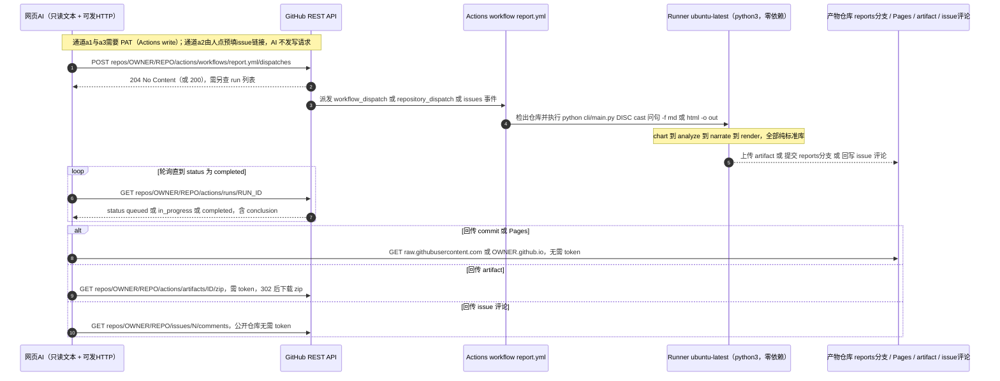

# 易（Yi）· 深度改造总体规划

> **文档定位**：易（Yi）项目深度改造的总体规划。本规划把云侧“给链接即出报告”工作流、网页端 AI 标准操作流程、“老师傅级”叙事与规则库、六科逐科增强与 core 机械因子扩充、拓展术数门类选型、分阶段里程碑与验收、以及需拍板的决策点，收拢为一份可直接执行的改造纲领；每条论断均可在仓库内或文末参考资料中溯源。
>
> **版本与日期**：v1.0，2026-09-30。
>
> **全篇口径（仓库铁律，方案立场不可协商）**：
> 1. **机械运算归代码，象数解读归 LLM**——起局、排盘、装卦、定宫、纳甲、安世应、推六亲、配六神、查旬空、判旺衰、算应期、识别格局，必须且只能由 Python 完成；LLM 只做“收集输入 → 调脚本 → 翻译输出”。
> 2. **案例库与预测过程物理隔离**——`**/cases/` 与 `references/case_library.md` 只在测试运行器读取、用户明确要求事后校验、用户主动询问“有无类似案例”三种场景可访问。
> 3. **口径诚实**——仓库内所有分数都是**古籍案例对齐分**（引擎输出与古籍案例要点的吻合度，用于回归审计），衡量不了现实世界命中率；报分必须带**集合名 + 样本量 n + 是否未参与调参的 holdout**；禁止出现“预测准确率”“断事如神”。
> 4. **措辞与边界**——凶象用“偏向／有…信号／结构上”，禁用“注定／一定／绝无必然／绝无可能”；医疗、法律、投资、重大决策一律提示以专业意见为准；**相科（面相、手相、堪舆）不做**，不预留目录、不写占位实现。
>
> **章节导航**：一、执行摘要｜二、现状审计｜三、云端“给链接即出报告”架构｜四、网页端 AI SOP｜五、老师傅叙事与规则库架构｜六、六科增强清单与 core 因子扩充｜七、拓展术数门类选型｜八、分阶段里程碑与验收标准｜九、增量改动｜十、需用户拍板的决策点｜参考资料。
>
> **配套交付**：`docs/DEEP-OPTIMIZE-PLAN.html`（单文件、完全离线、含三张内联 SVG 图解）。

---

## 一、执行摘要

用户四大诉求，本规划的核心判断：

1. **完整工作流 / skill 化**：六科已统一在"一份内核 `core/yishu_core/` + 共享契约
   `disciplines/base/`（chart→analyze→narrate→render）+ 统一 CLI `yi`"之上。本轮刷新
   统领 `SKILL.md` 与各科文档，消除"五科/六科""已归档/已还原"等自相矛盾。
2. **（核心）给链接即出报告**：网页端 AI 普遍只能读公开文本、发 HTTP，不能可靠 clone 跑 Python。
   关键设计是把问题拆成两半——**触发半场**（任何让 Actions 跑起来的写操作都必须有凭证，
   或由人点一下预填 issue 链接）与**读取半场**（公开仓库的 `raw.githubusercontent.com`、
   issue 评论、Pages 全部零凭证）。因此落地 **GitHub Actions 云端跑零依赖的 `yi`，
   报告 commit 到独立 `reports` 分支 + 回写 issue 评论，网页 AI 用无凭证 GET 取回 MD+HTML**。
   本轮已把该骨架（workflow + 统一报告运行器 + AI-SOP）写入仓库并本地端到端干跑验证。
3. **老师傅级单学科**：老师傅不是敢断言，而是**因子看得全、叙事有层次、判断有古籍出处、
   给条件化倾向与趋避**。落地统一的"条件→事类→倾向→强度→出处→趋避"规则库（文本进
   `data/*.json`，代码只做匹配加权），narrate 升级为六段式。本轮给出目标架构、schema、
   段落契约与六科增强清单（实施分阶段推进）。
4. **拓展门类**：以"机械可复现、规则封闭、core 复用度高、普适高频、不涉敏感、不依赖相科"
   为准入判据。推荐顺序 **P0 大六壬 → P1 焦氏易林 + 时家奇门 → P2 灵棋经 / 七政四余 /
   灵签 / 太乙**；铁板/邵子神数（不可复现、托名）与相科明确不做。

**本轮已落地（第一阶段骨架）**：统一报告运行器、GitHub Actions 工作流、网页 AI 操作手册、
统一 HTML 报告 kit（并修复一处 core 呈现层转义 bug）、六科与 ziwei 的文档/状态表修复。
**需用户拍板的决策点见第十章。**

---

## 二、现状审计

### 2.1 规模盘点（非 scratch、非 pycache 的 .py）

| 层 | 文件数 | 行数 | 成熟度 |
|---|---|---|---|
| `core/yishu_core/` | 16 | 2662 | 唯一真值源：干支历/节气/农历/纳甲/卦表/关系/神煞/纳音/评分/报告 |
| `disciplines/liuyao/` 六爻 | 56 | 22003 | **最成熟**，断语外置最彻底，有专用 mcp_server |
| `disciplines/ming/` 四柱 | 11 | 1034 | 机械推演已立；narrate 干巴（核心痛点） |
| `disciplines/meihua/` 梅花 | 10 | 1571 | 结构较完整，部分断语仍内联 .py |
| `disciplines/xiaoliuren/` 小六壬 | 10 | 1091 | 掌诀速断，事类偏窄 |
| `disciplines/zeji/` 择吉 | 10 | 1039 | 三因子裁决，缺月令×事类主表 |
| `disciplines/ziwei/` 紫微 | 8 | 731 | **最新最薄、在建**；14 条格局断语"断线"未被引用 |
| `synthesis/` 合参 | 6 | 1028 | person 档案 + normalize + cross_rules + guidance |
| `cli/` | 2 | 141 | 统一入口 `yi` |
| `tools/` | 6（本轮新增 4） | 1216 | check/eval/demo/install/mcp_router + report/ci_* |

### 2.2 架构现状（可信、作为改造基线）

- **四段契约**：`disciplines/base/protocol.py` 以 `Protocol` 强制 chart→analyze→narrate→render，
  段间只传结构化数据；`disciplines/base/cli.py` 提供 `DisciplineCLI` 基类。
- **依赖方向单向**：`base → core`、`学科 → base + core`、`synthesis → 学科 schema`、
  `cli → 学科`；学科之间禁止互相 import。
- **core 为唯一真值源**：干支历换算、节气、纳甲、卦表、六合六冲三合三刑六破、十二长生、
  墓库、旬空、纳音、神煞、十神/六亲、评分器、报告 kit 均只在 core 存一份。
- **零第三方必需依赖**（`dependencies=[]`，`requires-python>=3.10`），`pyproject` 注册全局 `yi`。
  这是 GitHub Actions 与（中期）Pyodide 可行的关键。

### 2.3 六爻对齐分基线（古籍案例对齐分，非命中率）

| 集合 | 综合对齐分 | n | 口径 |
|---|---|---|---|
| tune | 93.9% | 20 | 参与过调参 |
| holdout | 87.5% | 12 | 未参与调参 |
| wikisource_holdout | 57.3% | 35 | 维基文库原本，从未调参（**泛化短板**） |
| wikisource_direction | 72.2% | 36 | 有吉凶无应期 |

应期 top-1：tune 58.8% / holdout 50% / wikisource 20%。
红线：禁止对 holdout/wikisource 调参、禁 case-specific 分支；tune 均分无故跌破 95 即回归。

### 2.4 主要问题（对应四大诉求）

1. **云端能力缺失**：仓库原本无 `.github/`；六科报告一键入口不齐（实测仅 liuyao 能一步出
   MD+HTML，meihua/xiaoliuren/zeji 只出 chart JSON，ming 的 render 未在统一 CLI 注册）。
2. **不像老师傅**：ming/ziwei 的 narrate 把四柱/强弱裸分数/格局/喜用/大运/流年机械罗列，
   命宫身宫以 Python 对象形态直出，无分事类倾向、无古籍出处、无趋避；ziwei 的 14 条格局
   断语存在却无任何脚本引用（"断线"）；梅花等部分断语仍内联 .py。
3. **文档自相矛盾**：根 SKILL/HANDOFF 称三科已归档（实际已还原）；AGENTS/README 称五科
   （实际已多 ziwei）；MCP 文档过时。
4. **MCP 分散**：六爻有专用 mcp_server；`tools/mcp_router.py` 统一注册仅 ming，其余各科自带
   mcp_server 但未被统一挂载。

### 2.5 全绿基线

本轮以 `python tools/check.py --full`（含黑箱回归）与 `python -m pytest tests -q`（76 passed）
建立全绿基线；全部骨架落地与文档修复后复跑仍全绿。
本节列出第五章与第六章直接依赖的既有结构，便于后文「落位」有据；全项目盘点见第二章。

### 2.6 内核真值源（`core/yishu_core/`，只存一份的表与函数）

| 模块 | 已含内容（本规划用到的） |
|---|---|
| `symbols.py` | 干支、五行阴阳；`SHENG_CYCLE`/`KE_CYCLE` 生克；`HE_PAIRS` 六合、`CHONG_PAIRS` 六冲、`BREAK_PAIRS` 六破；`THREE_PUNISHMENTS`/`sanxing_hits` 三刑；`TOMB_MAP` 墓库；`ADVANCE_PAIRS`/`RETREAT_PAIRS` 进退神；`XUN_KONG`/`xunkong_of` 旬空；`TWELVE_GROWTH_STAGES`/`TWELVE_GROWTH_TABLES`/`TWELVE_GROWTH`/`twelve_growth` 十二长生；`SAN_HE_GROUPS`/`sanhe_group` 三合局；`NAYIN`/`nayin_of` 纳音；`NAJIA_BRANCHES` 纳甲支；`HEXAGRAM_TRIGRAMS`/`EIGHT_PALACES`/`BAGUA_LINES` 卦表；`XIAN_TIAN_TRIGRAM_NUMBERS` 先天数；`TRIGRAM_ELEMENTS`；`WANG_XIANG_XIU_QIU_SI`/`wangxiangxiuqiusi` 旺相休囚死 |
| `ming_tables.py` | `CANG_GAN` 藏干、`hidden_stems`、`canggan_ten_gods`；`dayun_direction` 大运方向；`ming_gong_branch`/`shen_gong_branch`/`ming_shen_gong` 命宫身宫；`palace_ganzhi` |
| `relations.py` | 阴阳、`element_of`、`wuxing_relation`；`six_relation` 六亲；`ten_god` 十神；`SHISHEN_TO_LIUQIN`/`LIUQIN_TO_SHISHEN` 互转；`relation_class` |
| `shensha.py` | 天乙贵人、文昌、羊刃、驿马、桃花、华盖、禄神、红艳、天喜、天德、月德（共 11 类）；`shensha_at_branches`、`shensha_of_chart` |
| `najia.py` | `najia_branch`、`response_position` |
| `ganzhi_calendar.py` | 十二节/十二气、`solar_term_instant`、`ganzhi_of`/`GanzhiMoment`、`next_jie_after`/`prev_jie_before`、`find_solar_date`、`months_ahead` |
| `ziwei_tables.py` | 紫微/天府星群顺序与安星、左辅右弼/文昌文曲/天魁天钺/火铃/地空地劫；**`PATTERNS`（格局名表）**、`SIHUA_TABLE`/`SIHUA_DIRECTION`（四化）、`PALACES`、`dayun_start_age`/`dayun_step_years`、`ming_gong_pos` |
| `zeji_tables.py` | 建除十二神（`JIAN_CHU_*`）、黄黑道十二神（`HUANG_HEI_DAO_ORDER`/`HUANG_DAO_GODS`/`HEI_DAO_GODS`/`day_god_of`/`hour_god_of`）、二十八宿（`XIU_*`/`xiuxiu_of`） |
| 其他 | `hexagram_texts.py`（`HEXAGRAMS`/`HEXAGRAM_LINE_TEXTS` 卦辞爻辞）、`lunar.py`、`eval.py`、`calendar_check.py`、`runtime.py`、`report/html.py`（报告骨架） |

### 2.7 四段契约与共享层

`disciplines/base/protocol.py` 定义四段 `Protocol`：`ChartProtocol` / `AnalyzeProtocol` / `NarrateProtocol` / `RenderProtocol`，并给出数据模型 `ChartData` / `Verdict{direction,confidence,description}` / `AnalysisData{chart,factors,verdict,basis}` / `NarrativeData{summary,reasoning,advice}`。`disciplines/base/cli.py` 提供 `DisciplineCLI` 基类。`synthesis/` 有 `person.py`/`normalize.py`/`cross_rules.py`/`guidance.py`/`outcome_eval.py`/`cli.py`。

### 2.8 各科 data 现状（`disciplines/<科>/data/`）

| 科 | data 目录内容 |
|---|---|
| liuyao | `verdicts.json`、`narrative_templates.json`、`trigram_symbolism.json`、`classical_patterns_data.json`；`rules/` 下有 `verdict_texts.json`、`advice_rules.json`、`question_use_gods.json`、`use_god_relations.json` |
| ming | 仅 `verdicts.json`（内容只有一个空骨架 `_meta`：「本轮不实现命理推演，故无吉凶断语」） |
| ziwei | 仅 `verdicts.json`（14 条「命宫格局」词条） |
| meihua / xiaoliuren / zeji | 各仅 `verdicts.json`（含 `narrate_phrases`） |

### 2.9 narrate 现状（“不像老师傅”痛点的现场证据）

- **六爻 `scripts/liuyao_narrate.py`（1616 行，最成熟）**：断语外置程度最高。`scripts/narrative_utils.py` 是**断语/模板的唯一取用器**，提供 `ctext`（取 `classical_rules_notes` 类断语）、`ctpl`（取 `classical_rules_templates` 拼装模板）、`note_text`、`vdesc`；加载 `data/verdicts.json`（`shi_yao_interpretation`/`shi_yao_poems`/`quote_database`）与 `data/rules/verdict_texts.json`（21 个 section，条目形如 `{"text": …, "basis": …}`，`basis` 可空、可含 `template`）。同文件内含 `_QUESTION_SCENARIO_KEYWORDS`，即 8 类**事类**关键词：`marriage/wealth/illness/career/exam/lawsuit/travel/parents_illness`。
- **命 `scripts/narrate.py`（93 行）**：**纯因子罗列**——四柱、日主、命宫/身宫、强弱（并直接输出裸分数 `strength_score`）、格局、喜用/忌、空亡、大运表、大运×流年、流年前六年；结尾三句免责。**无分事类倾向、无古籍出处、无趋避建议**。这是「不像老师傅」的核心痛点的直接成因。
- **紫微 `scripts/narrate.py`（90 行）**：同样是因子罗列——五行局、命宫、命宫主星、格局、紫微/天府所在、四化影响列表、大限走向与简表；同样无分事类、无出处、无趋避。
- **梅花 `scripts/narrate.py`（239 行）**：结构较完整（接问题→结论→盘面→万物类象→体用总诀与事类断语→互变生克→特断→旺衰应期→口径收尾），引《体用总诀》《体用生克篇》《卦断遗论》，**但一部分断语与引文内联在 .py 里**（如体用关系白话表、「生体多者则愈吉，克体多者则愈凶」），仅改口类短语走 `data/verdicts.json` 的 `narrate_phrases`。
- **小六壬 `scripts/narrate.py`（131 行）**：落宫→宫义/总诀→事类诀句→应期主数→综合权衡→口径；部分文案走 `narrate_phrases`，部分（宫义框架、口径提示）内联。
- **择吉 `scripts/narrate.py`（113 行）**：日盘要素（建除/黄黑道/二十八宿/时值神）→事类宜忌→口径；同样部分外置、部分内联。

### 2.10 两处需先纠正的既有事实（落位依据）

1. **文档与代码漂移**：`docs/ARCHITECTURE.md` 的目录树仍列 `chain_verdicts.py`（「断语/引文加载（唯一取用器）」），**实际文件是 `scripts/narrative_utils.py`**（模块 docstring 自述「合并自 chain_support.py 与 chain_verdicts.py」）；`docs/CHANGELOG.md` 通篇记 `chain_*` 系列，而现行脚本为 `liuyao_step1..5.py`／`liuyao_narrate.py`／`narrative_utils.py`／`effects.py`／`classical_enhancements.py`／`classical_analysis.py`／`classical_rules.py` 等。**凡涉及文件名，本规划一律用实际存在的 `liuyao_*`／`narrative_utils` 等，不用旧名。**（文档同步见第九章。）
2. **六爻侧有两套「事类」键，尚未归一**：`narrative_utils._QUESTION_SCENARIO_KEYWORDS` 用 `marriage/wealth/illness/career/exam/lawsuit/travel/parents_illness`（8 类，英文键），而 `rules/advice_rules.json` 的 `advice_rules` 用 `投资/事业/婚姻/出行/疾病/失物/诉讼/胎产/学业`（9 类，中文键）。两者覆盖不一致（如 `parents_illness` 在 advice 侧缺、`失物/胎产` 在关键词侧缺）。这是后文「事类归一」的直接依据。

---

## 三、云端“给链接即出报告”架构

**用户目标**：仓库传到 GitHub 后，网页端 AI（通常只能读公开文本 + 发 HTTP 请求，不能可靠 clone、不能本地跑 Python）只需"GitHub 链接 + 指定信息（起什么卦/取哪些数据）"就能拿到 Yi 的分析报告（HTML 或 MD）。

### 3.1 核心判断：把问题拆成“触发半场”与“读取半场”

把这件事拆成**触发半场**与**读取半场**，是本方案最核心的判断：

- **触发半场**：GitHub 上任何"让流水线跑起来"的写操作（`workflow_dispatch`、`repository_dispatch`、创建 issue）**都必需凭证**。纯"只读文本 + 发 HTTP"的网页 AI 无凭证时**不可能**自主触发一次 Actions 运行——这是硬约束，不是工程优化点。
- **读取半场**：公开仓库的运行状态、`raw.githubusercontent.com` 文件、issue 评论、Pages 页面，**全部无需凭证**。

因此推荐架构是 **「触发权可以少，读取权必须零」**：

> **Actions 云端跑 yi（触发用"预填 issue 链接由人点一下"或"有 PAT 时 API 直发"）＋ 报告 commit 到 `reports` 分支并发布 GitHub Pages ＋ 网页 AI 用无凭证 GET 读取 raw/Pages。**

只要报告落进**仓库文件**而不是只留在 Actions artifact，读取半场就彻底摆脱凭证——这是"给链接即出报告"能成立的关键设计选择。artifact 通道保留为人工下载的补充，不作 AI 的主路径。

### 3.2 前置事实与实测（本仓库已核实）

| 事实 | 出处 / 核实方式 |
|---|---|
| 主计算**零第三方依赖**（`dependencies = []`），`requires-python >= 3.10` | `pyproject.toml` |
| 注册全局命令 `yi = cli.main:main` | `pyproject.toml` |
| 统一入口 `yi <discipline> <command>`，六科：liuyao / ming / ziwei / meihua / xiaoliuren / zeji | `cli/main.py` |
| 各科四段契约 `chart→analyze→narrate→render` 以 Protocol 强制 | `disciplines/base/protocol.py` |
| 单文件 HTML 骨架（样式内联、无外部资源） | `core/yishu_core/report/html.py`（`render_page` / `write_html`） |
| **仓库当前没有 `.github/` 目录**，CI 全部需新建 | 仓库根列举 |
| `core/` 不在默认 `sys.path`，但各科脚本自行向上搜索内核并插入 sys.path | `disciplines/liuyao/scripts/kernel_path.py` |

**实测（本机 Python 3.14.7，未安装、直接跑仓库脚本）**：

```
python cli/main.py liuyao cast "占本周面试能否通过" --mode time --seed 7 -f md   -o report.md   → exit 0，3317 B
python cli/main.py liuyao cast "占本周面试能否通过" --mode time --seed 7 -f html -o report.html → exit 0，18875 B（以 `<!DOCTYPE html>` 起）
```

即 **CI 里无需 `pip install`，`python cli/main.py …` 可直接出报告**——这正是"零依赖"对云端方案的最大红利：没有安装步骤、没有网络依赖、没有版本漂移。

#### 3.2.1 已核实的阻塞项：改造前六科的报告一键入口不齐

实测各科 `--help`，命令行参数**并不统一**：

| 学科 | 统一 CLI 已注册命令 | 能否一步出报告（今天） | 实测参数 |
|---|---|---|---|
| liuyao 六爻 | cast / chart / analyze / narrate / render | **可以** | `cast "<问>" [--mode] [--seed] -f {md,html} -o OUT` |
| ziwei 紫微 | chart / analyze / narrate / render | 需两步（chart → analyze → render） | `chart … -o OUT`；`render [analyze_json] -o OUT` |
| ming 四柱 | 仅 chart / analyze（**render 未在统一 CLI 注册**，脚本存在） | 否 | `chart --datetime … --gender … -o OUT`；`analyze [chart_json] -o OUT` |
| meihua 梅花 | cast / chart | 否（只出 chart JSON） | `cast … -o OUT` |
| xiaoliuren 小六壬 | cast | 否（只出 chart JSON） | `cast … -o OUT` |
| zeji 择吉 | chart | 否（只出 chart JSON） | `chart … -o OUT` |

结论：**"给链接即出报告"若要覆盖全科，必须先补一个仓库级统一报告入口**（见本章 3.9），否则云端工作流只能覆盖六爻与紫微。这一点必须写进规划，否则方案会在多学科场景下静默失效。

### 3.3 路径对比（六条候选路径）

对比四类路径（(a) 再拆三个触发方式）：

| 路径 | 对"只读文本 + 能发 HTTP"的网页 AI 兼容性 | 后端/密钥 | 成本 | 延迟 | 可维护性 | 与"零依赖"契合度 | 回传报告便利度 |
|---|---|---|---|---|---|---|---|
| **a1** Actions + `workflow_dispatch`（REST 触发） | 中：**必须有 token** 才能发 POST；无 token 时该路径对 AI 不可用 | 需 GitHub PAT（细粒度 `Actions: write`） | 公开仓库 standard runner 免费（官方文档：public repo 中标准 GitHub 托管 runner 使用免费）；私有仓库 Free 档 2000 分钟/月 | 冷启动 + 排队，通常 20–90 s | 高（一份 yml；但 Actions 大版本更迭快） | **高**（runner 自带 python3，无需 pip） | 高（产物 commit/Pages/artifact 三选） |
| **a2** Actions + `issues` 标题/评论触发（**预填链接由人点一下**） | **高**：AI 只负责拼 URL + 无凭证读结果，全程不需要 token | **零密钥**（触发由人完成） | 同上 | 同上 | 中（需防滥用门禁） | 高 | 高 |
| **a3** Actions + `repository_dispatch` | 中：同样**必须有 token** | 需 PAT（`contents: write` 级别） | 同上 | 同上 | 高 | 高 | 高（`client_payload` 只适合放小参数） |
| **b** Pyodide 把零依赖内核搬上 GitHub Pages（纯前端） | 低-中：**需要能操作浏览器**才能用到；"只读文本 + 发 HTTP"的 AI 用不上，只能把 Pages 链接给用户 | **零后端、零密钥** | 零（静态托管） | **接近零**（算力在用户浏览器） | 中（需维护 wheel/zip 打包与 CDN 版本） | **极高**（`dependencies=[]` 是 Pyodide 的理想输入） | 低-中：结果在浏览器内，回传要靠下载/复制 |
| **c** MCP server（本地/IDE） | 低：stdio 需本地进程；Streamable HTTP 需 MCP 客户端支持 | 本地无需密钥；远程 HTTP 需部署+鉴权 | 本地零成本；远程需托管 | 低 | 中（协议在演进：现行 `2026-07-28` 规范已改为无状态核心、无 initialize 握手） | 高 | 中（工具返回结构化文本，非文件） |
| **d** 让网页 AI 直接 clone 跑 Python | **最低**：绝大多数网页 AI 无 shell、无持久文件系统、无法 clone | 不适用 | — | 不可控 | 不可维护 | 不适用 | 不可行 |

**逐条要点**

- **a1**：现行 REST 文档给出的触发端点是 `POST /repos/{owner}/{repo}/actions/workflows/{workflow_id}/dispatches`，`workflow_id` 可传工作流文件名（如 `report.yml`）；请求体 `ref` 必填（分支或标签名），`inputs` 为对象；`workflow_dispatch` **只有当工作流文件位于默认分支时才接收事件**（https://docs.github.com/en/rest/actions/workflows ，https://docs.github.com/en/actions/reference/workflow-syntax-for-github-actions ）。
- **a2**：这是**唯一零密钥**的 Actions 路径。GitHub 支持用查询参数预填 issue（`title`/`body`/`labels`/`assignees`/`milestone`/`projects`/`template`），文档示例 `https://github.com/octo-org/octo-repo/issues/new?title=New+bug+report&body=Describe+the+problem.`（https://docs.github.com/en/issues/tracking-your-work-with-issues/using-issues/creating-an-issue ）。
- **b**：Pyodide 把 CPython 编译到 WebAssembly，`loadPyodide()` 后 `pyodide.runPython()` 即可执行 Python；纯 Python wheel 可用 `micropip.install(<URL>)` 从任意 URL 安装，多文件包可用 `pyodide.unpackArchive(buffer, "zip")` 解包进虚拟文件系统（https://pyodide.org/en/stable/usage/quickstart.html ，https://pyodide.org/en/stable/usage/loading-packages.html ，https://pyodide.org/en/stable/usage/accessing-files.html ）。因为 Yi 主计算 `dependencies = []`，打包成本极低——这是 b 路径在别的项目里通常不成立、在这里却成立的原因。
- **c**：MCP 现行规范为 `2026-07-28`：核心已改为**无状态**（取消 initialize 握手与会话），传输层仍是 stdio 与 Streamable HTTP；Streamable HTTP 每个消息是一次 HTTP POST，可选 SSE 回复（https://blog.modelcontextprotocol.io/posts/2026-07-28/ ，https://modelcontextprotocol.io/docs/2026-07-28/learn/architecture ）。本仓库六爻/命/梅花/小六壬/择吉均自带 `mcp_server.py`，但 `tools/mcp_router.py` 只注册了 ming——这是 c 路径要先补的债。
- **d**：不建议投入。网页 AI 的执行环境不具备 clone + 运行 Python 的可靠能力；即便个别客户端有代码执行沙箱，也无法访问用户本地仓库。列为"不做"。

### 3.4 推荐与分阶段方案

**明确推荐：a2 为骨架，b 为体验增强，a1/a3 为有凭证方的加速通道，c 为专业客户端出口，d 不做。**

| 阶段 | 时间 | 交付 | 关键动作 |
|---|---|---|---|
| **短期** | 1–2 周 | **零密钥闭环：给链接即出 MD/HTML** | ① 新建 `.github/workflows/report.yml`，触发 = `workflow_dispatch` + `issues:[opened,labeled]` + `repository_dispatch:[yi-report]`；② 报告回传走 **commit 到 `reports` 分支**（`contents: write`），路径 `reports/<discipline>/latest.{md,html}` + 带时间戳归档；③ issue 触发时回写评论（`issues: write`）；④ 网页 AI 用 `raw.githubusercontent.com` 无凭证读取。 |
| **中期** | 1–2 月 | ① 全科统一报告入口；② Pyodide 在线排盘站；③ artifact 通道 | ① 新建 `tools/report.py`（或 `yi <disc> report`），把六科统一到 `--question/--format/--out`，并把 ming 的 render 挂进统一 CLI；② 用 `upload-pages-artifact` + `deploy-pages` 发布 `https://<OWNER>.github.io/<REPO>/`，内嵌 Pyodide 做**纯前端即时排盘**（零延迟、零成本）；③ 同一 workflow 追加 `upload-artifact`，供人工下载。 |
| **长期** | 3 月+ | MCP 归一 + 稳定 URL 契约 | ① 把 `tools/mcp_router.py` 从"只挂 ming"扩到全科（各科 `mcp_server.py` 已存在，只差挂载）；② 冻结"报告 URL 规范"（`reports/<discipline>/latest.md`、`.../latest.html`、`reports/index.json`），作为对外稳定契约，供任何 AI/客户端按学科取最新报告；③ 若要给"有 PAT 的客户端"用，再开放 a1 直发。 |

**为什么不把 Pyodide（b）当主路径**：它零延迟零成本，但要求调用方**能操作浏览器**，而题设的网页 AI 是"只读文本 + 能发 HTTP"。b 的正确定位是**给用户看的前端**（用户点开 Pages 就能即时排盘），而不是给 AI 用的接口——AI 用的接口是 raw/Pages 上的**已成文报告**。

### 3.5 触发→执行→回传端到端时序



> 上图有意把三条回传路径并列为 `alt` 分支——它们对应本章 3.6 的三种回传方式，权限要求各不相同。

### 3.6 三种回传方式权限对比

| 回传方式 | 工作流侧 `GITHUB_TOKEN` 权限 | 网页 AI 读取所需的凭证 | 读取端点 | 优点 | 缺点 |
|---|---|---|---|---|---|
| **commit 到 `reports` 分支**（**推荐主路径**） | `contents: write` | **无**（公开仓库） | `https://raw.githubusercontent.com/OWNER/REPO/reports/reports/<disc>/latest.md` | 零凭证读取、内容永久留档、diff 可审计、可同时出 md+html | 每次运行产生一次 commit；需处理并发推送冲突 |
| **发布 GitHub Pages** | `pages: write` + `id-token: write` | **无** | `https://<OWNER>.github.io/<REPO>/…html` | 用户点开即看、HTML 直接渲染、可托管 Pyodide 排盘页 | 只适合 HTML 不适合 MD；私有仓库需付费计划 |
| **回写 issue 评论** | `issues: write` | **无**（公开仓库） | `GET /repos/OWNER/REPO/issues/N/comments` | 与预填 issue 触发天然配套、用户可见闭环 | 评论有长度限制；MD 要放评论会被 GitHub 渲染吞掉部分语法 |
| **artifact** | 运行内上传用运行时令牌即可；若显式收紧 `permissions` 建议保留 `actions: write` | **需 token**（细粒度 `Actions: read` 或 classic `repo`） | `GET /repos/OWNER/REPO/actions/runs/{run_id}/artifacts` → `GET /repos/OWNER/REPO/actions/artifacts/{id}/zip` | 打包整目录、适合二进制/多文件；不污染仓库历史 | **需凭证下载**；未认证访问会被要求登录；默认保留 90 天后自动删除；zip 内为报告，AI 需解压 |

**权限模型要点（2026 现行）**

- `GITHUB_TOKEN` 的默认权限**取决于仓库设置**：个人账号新建仓库默认是**受限**模式，即 `contents` 与 `packages` 只读；组织仓库继承组织设置。**因此必须在 workflow 里显式声明 `permissions:`**，否则推送 `reports` 分支与回写 issue 都会 403（https://docs.github.com/en/repositories/managing-your-repositorys-settings-and-features/enabling-features-for-your-repository/managing-github-actions-settings-for-a-repository ，https://docs.github.com/en/actions/security-guides/automatic-token-authentication ）。
- 可声明的作用域为 `actions / checks / contents / deployments / issues / discussions / packages / pages / pull-requests / repository-projects …`，取值 `read|write|none`（https://docs.github.com/en/actions/reference/workflow-syntax-for-github-actions ）。
- **artifact 下载要凭证**这一点是明确的：下载端点文档只给"细粒度令牌需 `Actions` 读权限"，没有"公开资源可免认证"的豁免；而 `actions/upload-artifact` 的接口说明直言"该下载 URL 只对以 GitHub 身份认证的请求有效，匿名下载会被要求先登录；若需要匿名可用的 URL，请用下载 artifact API 生成短时受限 URL"（https://docs.github.com/en/rest/actions/artifacts ，https://raw.githubusercontent.com/actions/upload-artifact/043fb46d1a93c77aae656e7c1c64a875d1fc6a0a/action.yml ）。这就是**不能把 artifact 当 AI 主路径**的原因。
- 下载端点返回 **302 Found**，`Location` 指向上限 1 分钟的短期下载地址（Paid 断言见同一页）。
- artifact/日志默认保留 **90 天**，公开仓库可在 **1–90 天**区间调整（私有仓库 1–400 天）（https://docs.github.com/en/repositories/managing-your-repositorys-settings-and-features/enabling-features-for-your-repository/managing-github-actions-settings-for-a-repository ）。
- **Release 方式**（备选）：需 `contents: write`；对公开仓库，release asset 的下载端点可免认证访问（https://docs.github.com/en/rest/releases/assets ）——若希望报告以"版本化发布物"形式长期留存，这是比 artifact 更适合公众读取的通道。

### 3.7 本轮已落地文件（云端骨架，已完成）

| 文件 | 作用 |
|---|---|
| `.github/workflows/report.yml` | 云端出报告的 Actions 工作流：四类触发（`workflow_dispatch` / `issues` / `issue_comment` / `repository_dispatch`）、显式 `permissions`、零依赖直接跑仓库脚本 |
| `tools/report.py` | 统一报告运行器：把任一学科按 `chart→analyze→render` 端到端跑出 Markdown + 统一 HTML |
| `tools/ci_request.py` | 把四类触发归一解析为 `request.json` 与 `meta.json`，并输出 `should_run` / `has_issue` / `commit_branch` 三个门禁变量 |
| `tools/ci_publish_branch.py` | 把报告提交到 `reports` 分支，并回写可匿名读取的 raw URL |
| `tools/ci_deliver.py` | 触发源为 issue 时回写评论（含 raw 链接与内联正文） |
| `docs/AI-SOP.md` | 网页端 AI 标准操作手册（本规划第四章的运行时版本） |
| `core/yishu_core/report/html.py` | 报告 HTML kit：新增 `REPORT_CSS` 与 `report_page_from_markdown`；修复 `_md_inline` 先插标签后 escape 导致标签被转义成字面文本的呈现层 bug |

**本地端到端复跑（整理本规划时的实测）**：`python tools/report.py --discipline meihua --question "占本周面试能否通过" --outdir …` 与 `python tools/report.py --discipline liuyao --question "占本周面试能否通过" --datetime "2026-09-30 10:30" --outdir …` 均 exit 0，各自产出 `*.md` 与 `*.html`（HTML 以 `<!DOCTYPE html>` 起）。也就是说，3.2.1 记录的那条阻塞项——六科无法一键出报告——已由统一运行器消除。

### 3.8 已落地的触发与门禁（实际 workflow）

以下为仓库内 `.github/workflows/report.yml` 的实际内容（取代早期草案）：

```yaml

name: Yi 云端报告

# 网页 AI / 用户通过以下任一方式触发，runner 在零依赖环境跑 yi，产出 MD+HTML，
# 并通过 Artifact、reports 分支、issue 评论回传。详见 docs/AI-SOP.md。
# 注：workflow_dispatch 表单仅暴露常用 9 个字段（inputs 顶层属性有上限）；
# way/hour_branch/longitude 等高级字段请走 issue 正文 key:value 或 repository_dispatch。
on:
  workflow_dispatch:
    inputs:
      discipline:
        description: 学科
        type: choice
        options:
          - liuyao
          - ming
          - ziwei
          - meihua
          - xiaoliuren
          - zeji
        default: liuyao
      question:
        description: 求测问题（卜科；命科可留空）
        type: string
        default: ''
      datetime:
        description: '起算/出生时间，格式 YYYY-MM-DD HH:MM（命/紫微必填）'
        type: string
        default: ''
      gender:
        description: 性别（命/紫微用：男 或 女）
        type: string
        default: ''
      mode:
        description: 六爻起卦模式 coin/time/number/manual（留空按是否有时间自动）
        type: string
        default: ''
      numbers:
        description: 数字起卦/起课，逗号分隔
        type: string
        default: ''
      date:
        description: 择吉日期 YYYY-MM-DD
        type: string
        default: ''
      activity:
        description: 择吉事类（如 开市/嫁娶）
        type: string
        default: ''
      commit_branch:
        description: 是否提交到可匿名读取的 reports 分支
        type: boolean
        default: true
  issues:
    types: [opened, edited]
  issue_comment:
    types: [created]
  repository_dispatch:
    types: [yi-report]

# 回传需要：写 reports 分支（contents）、回写 issue 评论（issues）
permissions:
  contents: write
  issues: write
  actions: read

jobs:
  report:
    runs-on: ubuntu-latest
    timeout-minutes: 15
    steps:
      - name: 检出仓库
        uses: actions/checkout@v4

      - name: 配置 Python（零第三方依赖，不安装包）
        uses: actions/setup-python@v5
        with:
          python-version: '3.12'

      - name: 解析触发请求
        id: req
        env:
          INPUT_DISCIPLINE: ${{ github.event.inputs.discipline }}
          INPUT_QUESTION: ${{ github.event.inputs.question }}
          INPUT_DATETIME: ${{ github.event.inputs.datetime }}
          INPUT_GENDER: ${{ github.event.inputs.gender }}
          INPUT_MODE: ${{ github.event.inputs.mode }}
          INPUT_NUMBERS: ${{ github.event.inputs.numbers }}
          INPUT_DATE: ${{ github.event.inputs.date }}
          INPUT_ACTIVITY: ${{ github.event.inputs.activity }}
          INPUT_COMMIT_BRANCH: ${{ github.event.inputs.commit_branch }}
        run: python tools/ci_request.py --out request.json --meta meta.json

      - name: 端到端出报告（chart→analyze→render→HTML）
        if: steps.req.outputs.should_run == 'true'
        run: python tools/report.py --request request.json --outdir out --name report

      - name: 上传 Artifact（MD+HTML）
        if: steps.req.outputs.should_run == 'true'
        uses: actions/upload-artifact@v4
        with:
          name: yi-report
          path: |
            out/report.md
            out/report.html
          if-no-files-found: error

      - name: 提交到 reports 分支（可匿名 raw 读取）
        if: steps.req.outputs.should_run == 'true' && steps.req.outputs.commit_branch == 'true'
        env:
          GITHUB_TOKEN: ${{ secrets.GITHUB_TOKEN }}
        run: python tools/ci_publish_branch.py --meta meta.json --outdir out

      - name: 回写 issue 评论
        if: steps.req.outputs.should_run == 'true' && steps.req.outputs.has_issue == 'true'
        env:
          GITHUB_TOKEN: ${{ secrets.GITHUB_TOKEN }}
        run: python tools/ci_deliver.py --meta meta.json --outdir out

```

**落地时必须注意**

1. **Actions 大版本更迭频繁**。官方文档 2026-09 的 Python 示例用 `actions/checkout@v6`、`actions/setup-python@v5`、`actions/upload-artifact@v4`（https://docs.github.com/en/actions/tutorials/build-and-test-code/python ）；本仓库现行工作流用的是 `checkout@v4` / `setup-python@v5` / `upload-artifact@v4`。**落地时以各 action 仓库的最新 release 为准，不要照抄版本号。**本方案因零依赖，`setup-python` 只用于钉住解释器版本，不安装任何包——版本漂移面已压到最小。
2. **本仓库零依赖 → 完全不需要 `pip install`**。`python tools/report.py …` 直接在干净 runner 上可用（见 3.2 实测）。若某脚本依赖 `core/` 在 `sys.path`，各科已用 `kernel_path.ensure_kernel_on_path()` 自解决。
3. **随机种子必须可复现**。六爻 `cast` 支持 `--seed`；云端运行以可追溯的运行标识作种子，使同一运行可被事后复算。**起局随机性只能存在于“起课/起卦”这一步，且必须记录种子或投掷结果**（铁律一）。
4. **issue 触发的门禁不可省**。公开仓库上，`issues` 事件会让带写权限的 `GITHUB_TOKEN` 跑起来；Fork 审批策略只覆盖 `pull_request` / `pull_request_target`，**不覆盖 `issues`**（https://docs.github.com/en/actions/managing-workflow-runs/approving-workflow-runs-from-public-forks ）。因此 `tools/ci_request.py` 自行加了双重门禁：`issues` 事件必须解析出 `discipline` 字段（标题含 `[yi]` 或正文写了 `discipline:`），`issue_comment` 事件必须**以 `/yi` 开头**；`should_run` 为假时，出报告、上传 artifact、提交分支、回评四个步骤全部跳过。
5. **并发**：工作流固定 `timeout-minutes: 15`，并把报告按 `run_id` 分目录累积（`reports/<discipline>/<name>-<run_id>/`），避免两次运行互相覆盖 `reports` 分支内容。
6. **回传不依赖密钥托管**：`contents: write` 与 `issues: write` 用 GitHub 自动签发的 `GITHUB_TOKEN` 即可，无需用户自备 PAT（PAT 只在网页 AI 走 a1/a3 主动触发时才需要）。

### 3.9 落地前置改造清单与完成情况

| # | 改造 | 原因 | 估工 |
|---|---|---|---|
| 1 | 新建 `.github/workflows/report.yml` | 仓库当前无 `.github/` | 1 人日 |
| 2 | 新建**全科统一报告入口** `tools/report.py`（或 `yi <disc> report`），统一 `--question/--format/--out`，内部串 chart→analyze→narrate→render | 改造前实测：meihua/xiaoliuren/zeji 只出 chart JSON，ming 未注册 render；CI 无法覆盖全科 | 2–3 人日 |
| 3 | 把 `ming` 的 `render` 挂进 `cli/main.py` 的 `DISCIPLINE_COMMANDS` | 脚本已存在但未注册，统一 CLI 用不了 | 0.5 人日 |
| 4 | `reports` 分支初始化 + `reports/index.json`（记录各科最新报告路径与时间） | 给 AI 一个稳定的"发现入口" | 0.5 人日 |
| 5 | 在 `docs/` 写入"报告 URL 规范"并冻结 | 对外契约，避免路径随意变动 | 0.5 人日 |
> **完成情况**：上表五项在本轮均已闭环或部分闭环——① `.github/workflows/report.yml` 已建（四触发 + 显式 permissions）；② 统一报告入口 `tools/report.py` 已建并实测；③ 统一 CLI 侧的 `ming render` 注册与各科命令收口**未做**（归 Phase 1；云端侧已由 `tools/report.py` 绕过，不影响“给链接即出报告”）；④ `reports` 分支由 `ci_publish_branch.py` 按 run 累积写入，`reports/index.json` 未做（归 Phase 1）；⑤ 报告 URL 规范已写入 `docs/AI-SOP.md`，正式冻结归 Phase 1。

---

## 四、网页端 AI 标准操作流程（SOP）

**适用对象**：**只读公开文本 + 能发 HTTP** 的网页端 AI 助手。文中 `OWNER` / `REPO` / `TOKEN` 为占位符，`RUN_ID` / `ISSUE_NUMBER` / `ARTIFACT_ID` 为运行时实际值。

**命名对应**：本手册的三条通道即 3.3 路径对比里的 **a1 / a2 / a3**；仓库内 `docs/AI-SOP.md` 把同一件事记作通道 A / B / C。两者含义完全一致。

### 4.0 前置：各科需要哪些字段

不同学科必填项不同。字段名用英文，值里中文照写。

| 学科 `discipline` | 必填 | 常用可选 |
|---|---|---|
| `liuyao` 六爻 | `discipline`，`question`（所问之事） | `datetime`（给定则按时间起卦，格式 `YYYY-MM-DD HH:MM`；不给则随机摇钱）、`mode`（coin/time/number/manual）、`numbers`（数字起卦 `a,b,c`）、`longitude` |
| `ming` 四柱八字 | `discipline`，`datetime`（出生公历 `YYYY-MM-DD HH:MM`），`gender`（男/女） | `longitude`（真太阳时）、`question` |
| `ziwei` 紫微斗数 | `discipline`，`datetime`，`gender` | `longitude` |
| `meihua` 梅花易数 | `discipline`，`question` | `datetime`（不给则用当前时间）、`way`（默认 datetime）、`numbers` |
| `xiaoliuren` 小六壬 | `discipline`，`question` | `datetime`、`way`、`activity`（事类） |
| `zeji` 择吉 | `discipline`，`date`（`YYYY-MM-DD`），`activity`（如 开市/嫁娶） | `question`、`hour_branch`（时支） |

> 一卦一事：同一问题不重复占卜；用户换实质角度（换用神、换层面、比较两人、假设未来）应建议另起一次，不要在原报告里硬推。

### 4.1 步骤 0 · 前提自检（无凭证 GET）

```
GET https://api.github.com/repos/OWNER/REPO/actions/workflows
```

- 200 且列表内含 `report.yml` → 前提成立。
- 404 → 仓库私有或路径写错；结论：**无凭证路径不可用**，转步骤 5 的降级方案。
- 列表为空 → workflow 文件不在默认分支（`workflow_dispatch` 与 `issues` 事件都**只从默认分支的工作流文件接收事件**）（https://docs.github.com/en/actions/reference/workflow-syntax-for-github-actions ）。

### 4.2 步骤 1 · 触发（三条通道，按手上有无 token 选）

#### 4.2.1 通道 a1：`workflow_dispatch`（需要 `TOKEN`）

请求形态：`POST /repos/{owner}/{repo}/actions/workflows/{workflow_id}/dispatches`，`workflow_id` 可直接传文件名 `report.yml`；body 必含 `ref`，`inputs` 可选（https://docs.github.com/en/rest/actions/workflows ）。

```bash
curl -L -X POST \
  -H "Accept: application/vnd.github+json" \
  -H "Authorization: Bearer $TOKEN" \
  -H "X-GitHub-Api-Version: 2022-11-28" \
  https://api.github.com/repos/OWNER/REPO/actions/workflows/report.yml/dispatches \
  -d '{"ref":"main","inputs":{"discipline":"liuyao","question":"占本周面试能否通过","format":"markdown"}}'
```

- 成功响应通常为 **204 No Content**（部分客户端/网关版本返回 200），**这一步不直接返回 run id**——需按步骤 2 的列表接口取最新运行（https://docs.github.com/en/rest/actions/workflows ）。
- `inputs` 属性上限：工作流定义侧**最多 10 个顶层属性**、总长上限 65,535 字符；REST 参考页另称 25（https://docs.github.com/en/actions/reference/workflow-syntax-for-github-actions ）。**以 10 为准取交集**。
- 令牌权限：细粒度 PAT 需 `Actions: write`；classic PAT 需 `repo` 作用域（https://docs.github.com/en/rest/actions/workflows ）。
- **Windows PowerShell 注意**：PowerShell 会改写传给原生 exe 的引号，`-d '{"ref":"main"}'` 常被破坏。把 JSON 先落盘再 `-d @body.json`，或改用 `--data-raw` 并转义内部双引号。

#### 4.2.2 通道 a2：预填 issue 链接（**零 token，由用户点一下——无凭证 AI 的标准通道**）

AI 只负责**拼出链接并把链接给用户**，用户点击 → GitHub 预填表单 → 用户按提交 → `issues` 事件触发工作流。

**URL 编码规则**（基址 `https://github.com/{owner}/{repo}/issues/new`，查询参数 `title` / `body` / `labels` / `assignees` / `milestone` / `projects` / `template`）：

| 字符 | 编码 | 说明 |
|---|---|---|
| 空格 | `%20`（或 `+`） | 两种 GitHub 都接受 |
| 换行 | `%0A` | body 里当分隔符用 |
| `=` | `%3D` | 键值对里必编，否则被解析成参数分隔 |
| `&` | `%26` | 否则被当成参数边界 |
| `#` | `%23` | 否则被当成锚点 |
| `?` | `%3F` | |
| `+`（字面） | `%2B` | |
| `%`（字面） | `%25` | |
| 非 ASCII（中文等） | UTF-8 百分号编码 | 如「占」= `%E5%8D%A0` |

**做法**：对 `title` 与 `body` 的**整段值**做 `encodeURIComponent`（JS）或 `urllib.parse.quote(s, safe="")`（Python），再拼 `&`。

**可直接套用的示例**（下方 URL 的百分号编码由脚本生成、逐字节核对过；标题「【yi】liuyao 占问」、body 三行 `discipline=liuyao` / `question=占本周面试能否通过` / `format=markdown`）：

```
https://github.com/OWNER/REPO/issues/new?title=%E3%80%90yi%E3%80%91liuyao%20%E5%8D%A0%E9%97%AE&body=discipline%3Dliuyao%0Aquestion%3D%E5%8D%A0%E6%9C%AC%E5%91%A8%E9%9D%A2%E8%AF%95%E8%83%BD%E5%90%A6%E9%80%9A%E8%BF%87%0Aformat%3Dmarkdown&labels=yi-report
```

生成该 URL 的一行代码：

```python
from urllib.parse import quote
title = "【yi】liuyao 占问"
body  = "discipline=liuyao\nquestion=占本周面试能否通过\nformat=markdown"
print("https://github.com/OWNER/REPO/issues/new?title=" + quote(title, safe="")
      + "&body=" + quote(body, safe="") + "&labels=yi-report")
```

> `labels=yi-report` 是**安全阀**：工作流只在 issue 带上该标签时才执行，避免任何外部用户随手开 issue 就跑到带写权限的流水线。

#### 4.2.3 通道 a3：`repository_dispatch`（需要 `TOKEN`，可带任意 JSON）

```bash
curl -L -X POST \
  -H "Accept: application/vnd.github+json" \
  -H "Authorization: Bearer $TOKEN" \
  -H "X-GitHub-Api-Version: 2022-11-28" \
  https://api.github.com/repos/OWNER/REPO/dispatches \
  -d '{"event_type":"yi-report","client_payload":{"discipline":"liuyao","question":"占本周面试能否通过"}}'
```

`event_type` 映射到工作流的 `on.repository_dispatch.types`，`client_payload` 在运行内以 `github.event.client_payload` 取用（https://learn.microsoft.com/zh-cn/training/modules/github-actions-automate-tasks/2c-configure-github-actions-workflow ）。**只放小参数**（学科、问句、格式），长文本不要走这里。

### 4.3 步骤 2 · 轮询运行状态（必须退避）

```bash
# 2a. 已知 run_id（a1 直发拿到了 workflow_run_id）
curl -L -H "Accept: application/vnd.github+json" \
  https://api.github.com/repos/OWNER/REPO/actions/runs/RUN_ID

# 2b. 不知道 run_id：按事件类型取最近若干条，取第 1 条
curl -L -H "Accept: application/vnd.github+json" \
  "https://api.github.com/repos/OWNER/REPO/actions/runs?event=workflow_dispatch&per_page=5"

# 2c. 只要"已完成的成功运行"
curl -L -H "Accept: application/vnd.github+json" \
  "https://api.github.com/repos/OWNER/REPO/actions/runs?event=issues&status=completed&per_page=5"
```

- 判别字段：`status` ∈ `queued` / `in_progress` / `completed`；`conclusion` ∈ `success` / `failure` / `cancelled` / `skipped` / `timed_out` / `action_required` / `neutral` / `stale`（`status` 过滤参数接受这些取值，https://docs.github.com/en/rest/actions/workflow-runs ）。
- 用 `created` 参数可按时间窗收窄，避免翻到旧运行（同上）。
- **退避策略（必须）**：未认证请求的主限流是 **60 次/小时（按来源 IP）**，认证请求 5000 次/小时（https://docs.github.com/en/rest/using-the-rest-api/rate-limits-for-the-rest-api ）。因此轮询从 **15 s** 起、指数退避到 **60 s** 封顶，最多轮询 10 分钟；`status=queued` 时更不必高频探。**绝不要 1 秒一次地打。**
- 更省额度的做法：轮询 `raw` 产物（见 4.4）而不是 runs 列表——产物文件不消耗 API 额度。

### 4.4 步骤 3 · 取报告（四条路径）

**(A) commit 到 `reports` 分支 → 无凭证读取（首选主通道）**

工作流把报告提交到 `reports` 分支，路径按运行累积：`reports/<discipline>/<name>-<run_id>/`，其中 `<name>` 默认为 `report`。AI 只需按学科与 run id 拼 URL，**不消耗 API 额度、不需要 token**：

```bash
# 网页 AI 取最新一次报告：先按学科列 run，再取对应目录（或直接读 issue 评论里的 raw 链接）
curl -L "https://raw.githubusercontent.com/OWNER/REPO/reports/liuyao/report-RUN_ID/report.md"
curl -L "https://raw.githubusercontent.com/OWNER/REPO/reports/liuyao/report-RUN_ID/report.html" -o report.html
```

> 说明：早期草案曾设想固定路径 `reports/<discipline>/latest.md`。**实际落地的是按 run 分目录**（`reports/<discipline>/report-<run_id>/`），这样多次运行互不覆盖、可留档回溯；`reports/index.json` 这个“发现入口”列入 Phase 1（见 8.1）。

**(B) GitHub Pages → 无凭证读取**

```
https://<OWNER>.github.io/<REPO>/reports/liuyao/latest.html
```

（Pages 自定义工作流用 `actions/configure-pages@v5` → `actions/upload-pages-artifact@…` → `actions/deploy-pages@…`，部署 job 需 `permissions: pages: write` 与 `id-token: write`，并声明 `environment: github-pages`；GitHub Free 个人账号的 Pages 面向**公开仓库**开放，https://docs.github.com/en/pages/getting-started-with-github-pages/using-custom-workflows-with-github-pages ，https://docs.github.com/en/get-started/learning-about-github/githubs-plans ）

**(C) artifact → 需凭证**

```bash
# 1) 列出该次运行的产物，取 artifacts[].id
curl -L -H "Accept: application/vnd.github+json" -H "Authorization: Bearer $TOKEN" \
  https://api.github.com/repos/OWNER/REPO/actions/runs/RUN_ID/artifacts

# 2) 下载 zip（-L 跟随 302）
curl -L -H "Accept: application/vnd.github+json" -H "Authorization: Bearer $TOKEN" \
  -o yi-report.zip \
  https://api.github.com/repos/OWNER/REPO/actions/artifacts/ARTIFACT_ID/zip
```

zip 内即报告文件（`report.md` / `report.html`）。注意 302 后得到的是 **1 分钟有效**的短时地址（https://docs.github.com/en/rest/actions/artifacts ）。

**(D) issue 评论 → 无凭证读取**

```bash
curl -L "https://api.github.com/repos/OWNER/REPO/issues/N/comments"
```

### 4.5 步骤 4 · 错误码速查

| 码 | 含义 | 处理 |
|---|---|---|
| 404 | 工作流文件不在默认分支 / 文件名错 / 仓库私有 | 核对文件名与分支；确认仓库可见性 |
| 401 | `TOKEN` 无效或过期 | 换令牌；无令牌则改走 a2 |
| 403 | 令牌作用域不足（缺 `Actions: write` / `repo`），或触达限流 | 补作用域；读 `x-ratelimit-remaining` 后退避 |
| 422 | `inputs` 类型/数量不符工作流定义 | 对照 `on.workflow_dispatch.inputs` 逐项核对 |
| 200 但无 `workflow_run_id` | 客户端/网关差异 | 转步骤 2b 用列表兜底 |
| artifact 410 | 产物已过期删除 | 改读 `reports` 分支或 Pages |

### 4.6 步骤 5 · 无凭证 AI 的降级路径（必须写进 SOP，否则会在真实网页 AI 上碰壁）

若 AI 既无 `TOKEN` 也没有浏览器控制能力：

1. 步骤 1 改用**通道 a2**：AI 输出预填链接，提示用户"点击并提交"，或提示用户直接在该仓库开一个带 `yi-report` 标签的 issue。
2. 步骤 2–3 照常：**读运行状态、读 raw 文件、读 issue 评论都不需要凭证**——这是本方案"读取权必须零"的价值所在。
3. 若连"用户点一下"也不允许，则唯一剩下的形态是 **b（Pyodide Pages）**：AI 给链接、用户自己打开网页排盘。**不存在"AI 全程零凭证、零人工、纯靠 HTTP 让云端跑完再把报告递给 AI"的组合**——这一点在本规划中写死（见 4.6），避免后续重复试错。

---

## 五、“老师傅级”叙事与规则库架构

本章把“像老师傅”拆成可验收的标准，再给出统一的倾向规则 schema、文件组织、六段 narrate 段落契约，以及与六爻现有规则文件的复用/归一方案，最后给出可运行的最小样例与匹配器代码。**落位事实（内核表、契约、各科 data 与 narrate 现状）见 2.6–2.10。**

### 5.1 理念：老师傅 ≠ 信口断言

#### 5.1.1 四条可验收的标准

「像老师傅」不是把话说得古奥，也不是敢下结论，而是四件能被检查的事：

1. **因子看得全**——把盘面里所有与所问相关的因子都纳入判断：四柱之外还要看藏干、十神、调候、刑冲合害会方、墓库、十二长生、神煞；六爻之外还要看六神临用、持世、卦身、反吟伏吟、游魂归魂、进退神、三刑六冲、十二长生。因子不全，判断必偏——「因子看得全」只能是**机械因子层**的完备性问题，靠补充 core/学科因子表解决，不靠 LLM 现场联想。
2. **叙事有层次与火候**——先安盘、再定调、后分事、末给节律与建议，一段一个职责，不把结论抢在盘面前头，也不把七个因子堆成一张报表（现行命/紫微 narrate 即此病）。
3. **判断有古籍出处**——每一个带倾向的判断句都能追到书名与篇/卷；没有出处的是**推断**，必须如实标注为推断（沿用六爻 `use_god_basis` 已有的「《增刪卜易》：…」／「（问题词典·族名）」／「（消歧层，无逐字引文）」／「问题词典推断（族名·无古籍逐条出处）」四档诚实标注）。
4. **给「条件化倾向」与趋避建议**——输出的是「在…条件下，偏向…」，不是「一定会…」；并给出 2–4 条可执行的趋避（该进/该守/该等/该换路），而不是只报吉凶。

#### 5.1.2 在口径铁律下如何把握边界

| 边界 | 允许（✅） | 禁止（❌） |
|---|---|---|
| 断语力度 | 「偏向／有…信号／结构上偏紧」；「条件化倾向」 | 「注定／一定／必然／绝无可能」；把象当判 |
| 事类归属 | 用神覆盖域之内的事类，按规则命中逐条给 | 超出用神覆盖域的断言（对方家庭背景、未来伴侣身份、对方心里想什么）——属臆测 |
| 一卦一事 | 换实质角度时提议**另起一卦** | 在原卦里延伸硬推新事类 |
| 重大事项 | 医疗/法律/投资/重大决策 → 末段强制「以专业意见为准」 | 以象代医嘱、代法律意见、代投资决策 |
| 分数表述 | 「古籍案例对齐分（集合名/n/是否 holdout）」 | 「预测准确率/断事如神」；只给一个百分比不给集合名与 n |
| 出路叙事 | 有经文依据（注明出处）或卦象理据（某动变/某合冲）的推演 | 无依据的安慰话（「正缘散场后才清晰」之类） |

**落点**：上表右侧的每一条禁止，都要变成**机器可校验的约束**（见 6.4「跨科统一验收与口径纪律」），而不是只写在文档里的自律口号。

### 5.2 规则库目标架构

#### 5.2.1 三条设计原则

1. **条件匹配与加权归代码**：代码负责「读因子 → 匹配条件 → 按极性与权重累加」，产出结构化的命中集；**文本（倾向句、出处引文、趋避文案）一律在 `data/*.json`**，`.py` 里不得出现中文断语字面量（铁律 §三）。
2. **一份 schema，六科共用**：六科不同「因子名」，但「条件→事类→倾向→强度→出处→趋避」的**字段结构一致**；学科只提供各自的**因子名表**与 `data` 内容，不各自发明 schema。
3. **单一取用器**：每科只保留一个「断语/规则取用器」（六爻已有的 `narrative_utils.ctext/ctpl` 即范式），杜绝多副本（六爻历史上曾出现同一断语五份逐字节相同副本、改口径要改五处，见 `narrative_utils.ctext` docstring）。

#### 5.2.2 倾向规则 schema（`data/*.json`）

核心一条规则的结构：**条件（盘面/命局因子的布尔或阈值组合）→ 事类 → 倾向文本 → 倾向强度/权重 → 古籍出处（书名 + 篇/卷）→ 趋避建议**。

```json
{
  "_meta": {
    "说明": "事类倾向规则库（Tendency Rules）。条件→事类→倾向→强度→出处→趋避；代码只做因子匹配与加权。",
    "schema_version": 1,
    "categories": ["self", "wealth", "career", "marriage", "health", "travel",
                   "exam", "lawsuit", "parents", "children", "home", "lost"],
    "category_labels": {"self": "自身", "wealth": "财", "career": "官/事业", "marriage": "婚",
                        "health": "疾", "travel": "出行", "exam": "学业", "lawsuit": "讼",
                        "parents": "父母", "children": "子女", "home": "家宅", "lost": "失物"},
    "strength_scale": {"min": -3, "max": 3,
                       "note": "极性与权重；仅同一规则集内可比，不跨盘、不跨科比较"},
    "tone_policy": "倾向句只可出现「偏向/有…信号/结构上」；出现「注定/一定/必然/绝无可能」即判不合规"
  },
  "rules": [
    {
      "id": "ming.pattern.shangguan_peiyin",
      "discipline": "ming",
      "when": {
        "all": [
          {"factor": "pattern.name", "op": "eq", "value": "伤官格"},
          {"factor": "strength.level", "op": "in", "value": ["偏弱", "弱", "极弱"]},
          {"factor": "stems.visible", "op": "intersects", "value": ["正印", "偏印"]}
        ]
      },
      "category": "self",
      "tendency": "印绶护身：偏向以学识、资历、专业立身；遇事有靠山或平台替你缓冲，不逞一时之快。",
      "strength": {"weight": 2.0, "polarity": "+"},
      "basis": [
        {"book": "子平真诠", "chapter": "论伤官",
         "quote": "有伤官佩印者，印能制伤，所以为贵，反要伤官旺，身稍弱，始为秀气。"}
      ],
      "advice": [
        "走「印」的路：进修、考证、依托师门或平台积累资历",
        "伤官旺则才气与口舌易出头；公开表达前先把分寸磨一磨"
      ],
      "tags": ["伤官", "佩印", "身弱", "护身"]
    }
  ]
}
```

**`when` 的语法（代码侧唯一需要实现的东西）：**

- 组合子：`all`（并）、`any`（或）、`not`（非）；可嵌套，缺省视为 `all`。
- 子句：`{"factor": <点路径>, "op": <算子>, "value": <标量或数组>}`。
- `op ∈ {eq, ne, in, contains, intersects, gte, lte, between, exists, absent}`。
- `factor` 是**因子点路径**，指向 `analyze` 输出里已机械算好的值；不为空时才算命中（缺因子即不命中，绝不猜）。各科因子名表见第六章。

**为什么要「因子点路径」**：现行命/紫微的 `narrate` 直接读 `conclusion`/`chart_summary` 的零散键，没有统一的「可匹配因子层」。要规则化，`analyze` 必须先把因子**拍平**成稳定路径（`pattern.name`/`strength.level`/`useful_gods`/`dayun[].ten_god`…）。**拍平是纯机械操作，归代码**；这一步是「因子看得全」与「规则可匹配」的共同前置。

#### 5.2.3 学科级文件组织

```
core/yishu_core/                     # 象数基元唯一真值源（新增表先进这里，见 6.1）
  diaohou.py                         # 新增：调候查表（穷通宝鉴），纯机械

disciplines/<科>/data/
  verdicts.json                      # 断语 / 诗诀 / 引文库（沿用现有形态）
  narrative_templates.json           # 段落装配词（lead/joiner/模板），只放"怎么拼句"
  rules/
    tendencies.json                  # 新增：上文统一 schema 的「条件→事类→倾向」
    <科专有>                          # 如 ming: diaohou.json / shensha_notes.json
                                      #    ziwei: patterns.json / sihua.json
                                      #    liuyao: （沿用现有四件，见 2.5）
```

分工一句话：**`narrative_templates.json` 管「怎么把话说顺」，`rules/tendencies.json` 管「说什么、凭什么说」。** 六爻现状是把两者混在 `verdict_texts.json`（断语+出处）与 `narrative_templates.json`（装配词）两处，其中断语侧缺「条件/事类/强度」三要素——这正是要补的。

#### 5.2.4 六段式 narrate 的「段落契约」

**段落契约** = narrate 的**装配顺序 + 每段的输入字段 + 每段的输出要求**。六段固定，逐段说明如下（括号内为输入来源的 JSON 路径）。

| # | 段落 | 输入字段（analyze 输出） | 输出要求 |
|---|---|---|---|
| 1 | **定盘** | `chart_summary`（四柱/日主/命宫/身宫；或卦名/世应/旬空；或宫位/掌诀）＋ `divination_time`/`birth` | 1–2 句锁定盘面骨架，回答「这是一张什么盘」；**只陈述事实，不解释吉凶** |
| 2 | **格局基调** | `pattern.name`（或卦体性质、宫位五行局）＋ `strength.level` ＋ `格局依据` | 用 1–2 句给整体基调（身强身弱、何格、卦体刚柔）；出现术语顺口带一句出处 |
| 3 | **用神/日主得失** | `use_god.category` ＋ 旺衰（`strength.level`/`strength_score`）＋ 六神临用 ＋ 持世 ＋ 生扶/克制来源（`factor_contributions[]`） ＋ `hexagram_body_note`（六爻） | 把「用神/日主状态」译成「**对这件事意味着什么**」；必须把六神临用、持世**叙成自然语言**，不允许只贴数字（沿用六爻 SKILL §3.5 的强制叙事要素） |
| 4 | **分事类倾向** | 命中规则集 `[{rule_id, category, tendency, strength, basis}]`（来自 `rules/tendencies.json`） | 每个命中事类一段：**倾向句 + 强度词 + 出处**；未命中的事类明说「此盘未覆盖该事类」，**不得**用别的盘/案例补 |
| 5 | **大运流年节律（命）／ 应期（卜）** | 命：`dayun[]`、`liunian[]`、`dayun_liunian[].relations[]`；卜：`timing.timing_rules[]`、`yingqi_dates.dates[]` | 只给**主/次**节律并说清「凭什么推出这一支」；**禁止**把 `candidates_all` 之类的候选长列表堆给用户（六爻 SKILL 明令） |
| 6 | **趋避与免责** | 按事类取 `advice`（六爻沿用 `advice_rules.json`）＋ 口径字段 | 2–4 条可执行趋避 ＋ 边界声明（倾向措辞、重大事项以专业意见为准） |

**与四段契约的映射**：段落 1–5 的数据全部来自 `AnalysisData`（`chart`/`factors`/`verdict`/`basis`）——`factors` 承载因子与命中集，`basis` 承载出处，`verdict.direction/confidence/description` 承载总倾向；段落 6 对应 `NarrativeData.advice`。**若要把「命中集」正式加进 `AnalysisData`（如在 `factors[]` 中新增 `kind:"tendency"` 的元素），属对 base 契约的扩展，属决策点（见第十章 D7）**；在未扩展前，本契约可由学科在 `narrate` 内部按上述字段消费，不动 base。

#### 5.2.5 与六爻现有规则文件的关系（复用 / 归一 / 迁移）

**总策略：不复刻、不大搬家。** 六爻断语外置已成规模且经过「零指纹漂移」验收（见 `docs/CHANGELOG.md`），**字面量一律不迁移**；只做「加壳」——用新的 `tendencies.json` 承载「条件/事类/强度」，与既有断语以 `rule_id ↔ note key` 关联。逐文件如下：

| 现有文件 | 现有内容 | 与目标 schema 的关系 | 处理 |
|---|---|---|---|
| `rules/verdict_texts.json` | 21 段、条目 `{text, basis}` | 已是「断语+出处」的最小形态，但**无条件/事类/强度** | **复用** `text`/`basis` 作倾向句与出处的语义源；新增 `tendencies.json` 只写 `when`/`category`/`strength` 并用 `text_key` 指回本条，避免字面量二份 |
| `narrative_templates.json` | 11 段装配模板（`bing_yao`/`shensha`/`pattern_hints`/`verdict_openings`/`change_sentences`/`special_sentences`/`advice_soft`/`narrate_shell` 等） | 属「段落装配词」，**不是**「条件→倾向」 | **保留**为 narrate 装配层；`special_sentences`/`pattern_hints` 中带条件的部分（六冲/反吟/伏吟/游魂/归魂）**归并**为 `tendencies.json` 的对应条件规则，模板仍复用其句 |
| `rules/advice_rules.json` | 9 中文类目 × `auspicious/neutral/inauspicious` 各 3 条 ＋ `category_keywords` | 正是目标 schema 的 **advice 字段来源** | **复用**为趋避文案源；把 9 中文类目与 canonical 事类 id 做**映射表**（见下） |
| `rules/question_use_gods.json` | 186 条问法→六亲、64 族、`basis{citation/inference}`、`layer_citations`（7 类） | 属**取用神层**，非倾向层 | **保留不动**；其「族」与 canonical 事类 id 建映射 |
| `rules/use_god_relations.json` | 15 条「关系优先于事项」取用神规则，每条带逐字引文 + 偏移量 | 属取用神层 | **保留不动** |
| `data/verdicts.json` | `shi_yao_interpretation`/`shi_yao_poems`/`quote_database` | 断语/诗诀/引文库 | **保留**；`quote_database` 作为 `basis` 引文的可选来源之一 |
| `narrative_utils.py` | `ctext`/`ctpl`/`note_text`/`vdesc` 唯一取用器；`_QUESTION_SCENARIO_KEYWORDS` | 取用器 + 事类关键词 | 取用器**保留并扩展**一个 `match_rules(factors, path)`；事类关键词并入 canonical 映射 |

**归一要点（六爻内部）**：把 `_QUESTION_SCENARIO_KEYWORDS`（8 英文键）与 `advice_rules.json`（9 中文键）**归一为一份 canonical 事类 id 表**（建议 `self/wealth/career/marriage/health/travel/exam/lawsuit/parents/children/home/lost`），两张旧表各自写映射过去。**canonical 表放 `disciplines/base/`（共享常量）还是 `synthesis/`，属决策点（见第十章 D5）**——本规划建议 `base`（六科都要用，不该只服务合参），但需裁定后再动。

**另一处待归位**：`verdict_texts.json` 里有一条 `zeji_validity_gap`（「规则应用黑箱」），语义指向**择吉**，却落在**六爻**数据目录。建议归位到 `zeji/data/`——**是否迁出及迁移方式属决策点（见第十章 D8）**。

#### 5.2.6 八字、紫微如何对齐这套规则库

**八字（缺口最大，收益最大）**

- 现状：`disciplines/ming/data/verdicts.json` **只有空 `_meta`**；断语无处可放，`narrate` 只能罗列因子（含裸分数）。
- 目标：新建 `disciplines/ming/data/rules/tendencies.json`（格局×强弱×喜用 → `self/wealth/career/marriage/health/…`）与 `rules/diaohou.json`（日主×月令 → 调候用神 + 倾向 + 出处）；`narrate` 改为「读 `analyze` 因子 → 命中规则 → 装配六段」（见 5.3.1 样例）。
- 前置：`analyze` 增一层**因子拍平**（`pattern.name`/`strength.level`/`stems.visible`/`useful_gods[]`/`dayun[].ten_god`/`liunian[].gz`/`hidden_stems`…）。**拍平纯机械，归代码**；这是八字能否被规则匹配的关键一步。
- 注意：命科现有 `narrate` 的结尾三句（「不是命运断言」「tentative 标注」「不宣称命中率」）是合规资产，**必须保留进第 6 段**，不是删掉，而是并入趋避与免责。

**紫微（有现成数据但「断线」）**

- 现状：`disciplines/ziwei/data/verdicts.json`（14 条「命宫格局」）**未被任何 `.py` 引用**（只有 `dev_tools/check.py` 要求该文件存在）；真正接入的是 `core/yishu_core/ziwei_tables.py` 的 `PATTERNS`（**格局名**）与 `SIHUA_TABLE`/`SIHUA_DIRECTION`（四化）。即：**格局的「名」在 core，格局的「话」在 data 却断线。**
- 目标（把「名」与「话」分开）：
  - **格局名（机械标签，属 core）**留在 `core/yishu_core/ziwei_tables.py::PATTERNS`——它不是断语，是 lookup 键，留 core 正当。
  - **格局断语（文字，属 data）**迁入 `disciplines/ziwei/data/rules/patterns.json`，用统一 schema；`analyze` 命中格局后按 `pattern_id` 反查断语。
  - 把已存在但断线的 `data/verdicts.json` 的 14 条内容**并入**新文件后删除该文件（同时改 `dev_tools/check.py` 的必检清单），**消除两份真相**。
- 复核口径：断语进 `data` 是铁律 §三；但「格局名」不是断语，是机械标签，留 core 不违规——这条界线要在评审时讲清，避免把 `PATTERNS` 误当成违规的「代码里堆断语」。

### 5.3 最小可运行规则样例与匹配器

两个样例都展示「条件匹配如何落到文本」：`when` 命中 → 取倾向句与出处 → 装配成一段人话。**注意 .py 侧只出现算子与加权，不出现任何中文断语。**

#### 5.3.1 八字样例（伤官格 + 身弱 + 印星透出 → 印绶护身）

**规则（`disciplines/ming/data/rules/tendencies.json`）：**

```json
{
  "id": "ming.pattern.shangguan_peiyin",
  "discipline": "ming",
  "when": {
    "all": [
      {"factor": "pattern.name", "op": "eq", "value": "伤官格"},
      {"factor": "strength.level", "op": "in", "value": ["偏弱", "弱", "极弱"]},
      {"factor": "stems.visible", "op": "intersects", "value": ["正印", "偏印"]}
    ]
  },
  "category": "self",
  "tendency": "印绶护身：偏向以学识、资历、专业立身；遇事有靠山或平台替你缓冲，不逞一时之快。",
  "strength": {"weight": 2.0, "polarity": "+"},
  "basis": [
    {"book": "子平真诠", "chapter": "论伤官",
     "quote": "有伤官佩印者，印能制伤，所以为贵，反要伤官旺，身稍弱，始为秀气。"}
  ],
  "advice": [
    "走「印」的路：进修、考证、依托师门或平台积累资历",
    "伤官旺则才气与口舌易出头；公开表达前先把分寸磨一磨"
  ],
  "tags": ["伤官", "佩印", "身弱", "护身"]
}
```

**`analyze` 输出的因子（拍平后的可匹配部分，示意）：**

```json
{
  "factors_flat": {
    "pattern.name": "伤官格",
    "strength.level": "弱",
    "day_stem": "甲",
    "month_branch": "午",
    "stems.visible": ["伤官", "正印", "偏印", "正财"],
    "useful_gods": ["印", "比"],
    "taboo_gods": ["财", "官"]
  }
}
```

**匹配 → narrate 第 4 段输出（示意）：**

> 你这盘是**伤官格**、身偏弱——伤官把日主泄得厉害，好在**正印透出**。《子平真诠·论伤官》说得直白：「有伤官佩印者，印能制伤，所以为贵……身稍弱，始为秀气。」以此看，**偏向**以学识、资历、专业立身：有靠山、有平台替你挡一挡，别逞一时口快。**信号**上印为用，读书进修、考证积累资历，比硬碰硬更顺。

#### 5.3.2 六爻样例（用神得日月生扶、无冲克 → 事类偏向易成）

**规则（`disciplines/liuyao/data/rules/tendencies.json`）：**

```json
{
  "id": "liuyao.use_god.sheng_fu_no_chong",
  "discipline": "liuyao",
  "when": {
    "all": [
      {"factor": "use_god.strength.level", "op": "in",
       "value": ["旺", "相", "中和偏旺", "中和"]},
      {"factor": "use_god.supported_by", "op": "intersects",
       "value": ["月建", "日辰", "动爻"]},
      {"factor": "use_god.clashed_by", "op": "absent"}
    ]
  },
  "category": "*",
  "tendency": "用神有气又有生扶、且无冲克——事类偏向可成，谋望顺利。",
  "strength": {"weight": 2.0, "polarity": "+"},
  "basis": [
    {"book": "增删卜易", "chapter": "千金赋",
     "quote": "用爻有气无他故，所作皆成；主象徒存更被伤，凡谋不遂。"}
  ],
  "advice": ["此象宜进不宜守：该谈的、该递的，趁用神有气时推进"],
  "tags": ["用神", "得生扶", "无冲克", "事易成"]
}
```

> 出处核对：《增删卜易》以《千金赋》「用爻有气无他故，所作皆成；主象徒存更被伤，凡谋不遂」为此类判断的通用纲领；《岁考科考章》亦言「父与世爻旺相，又得日月动爻生扶……全无破绽者，定考超等」——可作「得日月动爻生扶→易成」的同源佐证（出处见文末）。

**匹配 → narrate 第 4 段输出（示意）：**

> 用神得**月建相、日辰生**，又无冲克——《增删卜易·千金赋》讲「用爻有气无他故，所作皆成」。就你问的这件事，卦象结构上**偏向**顺遂、成事的面大；**偏向**可进不可守。

#### 5.3.3 匹配器（代码只做因子匹配与加权）

放法：扩展现有的唯一取用器（六爻 `narrative_utils.py`），或新建学科级 `rules_engine.py` 供六科共用（共用则入 `disciplines/base/`，**归属属决策点（见第十章 D10）**）。

```python
# 只含算子表与加权算法；断语/出处/趋避全部来自 data/*.json（铁律 §三）
_OPS = {
    "eq":        lambda v, x: v == x,
    "ne":        lambda v, x: v != x,
    "in":        lambda v, x: v in x,
    "contains":  lambda v, x: x in v,
    "intersects":lambda v, x: bool(set(v or []) & set(x or [])),
    "gte":       lambda v, x: v is not None and v >= x,
    "lte":       lambda v, x: v is not None and v <= x,
    "between":   lambda v, x: v is not None and x[0] <= v <= x[1],
    "exists":    lambda v, x: v is not None,
    "absent":    lambda v, x: v is None or v == [] ,
}

def _dig(factors, path):
    """点路径取值，如 'use_god.strength.level' / 'stems.visible' / 'dayun.0.ten_god'。"""
    cur = factors
    for seg in path.split("."):
        if isinstance(cur, dict):
            cur = cur.get(seg)
        elif isinstance(cur, list) and seg.isdigit():
            cur = cur[int(seg)] if int(seg) < len(cur) else None
        else:
            return None
    return cur

def _clause_ok(factors, clause):
    return _OPS[clause["op"]](_dig(factors, clause["factor"]), clause.get("value"))

def match_rules(factors, rules):
    hit = []
    for r in rules:
        w = r.get("when", {})
        if not all(_clause_ok(factors, c) for c in w.get("all", [])):
            continue
        if w.get("any") and not any(_clause_ok(factors, c) for c in w["any"]):
            continue
        if any(_clause_ok(factors, c) for c in w.get("not", [])):
            continue
        hit.append(r)
    return hit

def score(hits, category=None):
    """极性和 × 权重，得某事类的倾向强度（仅同规则集内可比）。"""
    picked = [h for h in hits if category in (None, "*", h.get("category"))]
    return round(sum(h["strength"]["weight"] * (1 if h["strength"]["polarity"] == "+" else -1)
                     for h in picked), 2)
```

`narrate` 侧只做三件事：`match_rules` 取命中集 → 按 `tendency`/`strength`/`basis` 装段 → 按 `advice` 出趋避。**它不重算因子，也不重写判断**（与四段契约一致）。

---

## 六、六科逐科增强清单与 core 机械因子扩充

本章先清洗内核（哪些机械因子已存在、哪些要新增、哪些留在学科层），再给出六科的逐科增强清单、六爻泛化的通用正法路线，以及一组可机器校验的跨科验收纪律。**“已存在 vs 需新增”的判据来自对 `core/**/*.py` 的全目录核查，未逐一比对者已标明“需核实”。**

### 6.1 core 机械因子扩充清单

**核查原则（依 `AGENTS.md` §二）**：新增规则表先确认 core 没有；没有就加进 core，**不要就地新建**；学科不得复制 core 的表。因此本清单把每项落到「**放 core 哪个模块**／**是否已存在**」，并区分「已存在→只需接入或去重」「core 缺→新增」「学科专有→不入 core」三类。**凡标「需核实」者，指本轮未逐一比对全部科目层，落地前须再核一次。**

#### 6.1.1 已存在于 core / 学科层（先核实，只需接入或去重，不必新增）

| 因子（任务点名） | 现状位置 | 本轮核实结论 |
|---|---|---|
| **十二长生** | `core/symbols.py` `TWELVE_GROWTH_STAGES`/`TWELVE_GROWTH_TABLES`/`twelve_growth` | **已存在**。六爻已在用（`narrative_utils._twelve_growth_at_day`、`liuyao_step3` 修正项）；**八字层未接入**，需接。 |
| **墓库** | `core/symbols.py` `TOMB_MAP` | **已存在**；八字层未接入。 |
| **进退神** | `core/symbols.py` `ADVANCE_PAIRS`/`RETREAT_PAIRS` | **已存在**；六爻 `liuyao_step4` 已用（`化进神`/`化退神`）。 |
| **刑冲合害会方** 中的 合/冲/破/刑/三合 | `core/symbols.py` `HE_PAIRS`/`CHONG_PAIRS`/`BREAK_PAIRS`/`THREE_PUNISHMENTS`/`SAN_HE_GROUPS` | 合、冲、破、刑、三合**已存在**；**「六害」「三会（会方）」core 缺**（见 6.1.2）。 |
| **纳音** | `core/symbols.py` `NAYIN`/`NAYIN_TO_ELEMENT`/`nayin_of` | **表已存在**；「纳音取用」（把纳音纳入取用/判断链）**未实现**——属 取用逻辑（`analyze`）+ 数据，不是 core 新表。 |
| **命宫 / 身宫** | `core/ming_tables.py` `ming_gong_branch`/`shen_gong_branch`/`ming_shen_gong` | **已存在**；`ming/scripts/chart.py` 已调用。 |
| 十神 / 六亲 | `core/relations.py` `ten_god`/`six_relation`/`SHISHEN_TABLE` | 已存在。 |
| 旺相休囚死 | `core/symbols.py` `WANG_XIANG_XIU_QIU_SI`/`wangxiangxiuqiusi` | 已存在。 |
| **六爻·六神配爻** | `liuyao/scripts/chain_tables.py::SIX_SPIRITS` ＋ `liuyao/scripts/chart_tables.py::SIX_SPIRITS`、`SIX_SPIRIT_START`（甲乙→0 青龙…戊→2 勾陈） | **已存在**，且起法（甲乙起青龙…）已合《卜筮正宗·六兽歌》。**但 `SIX_SPIRITS` 在两个文件各一份，须归一**（见 6.1.3）。 |
| **六爻·反吟 / 伏吟** | `liuyao/scripts/liuyao_step4.py` | **已存在**。 |
| **六爻·游魂 / 归魂** | `liuyao/scripts/chart_tables.py` `genera`（游魂 4／归魂 3） | **已存在**。 |
| **紫微·四化（表）** | `core/ziwei_tables.py` `SIHUA_TABLE`/`SIHUA_DIRECTION` | **已存在**。 |
| **紫微·四化入宫** | `ziwei/scripts/chart.py`（按 `SIHUA_TABLE` 把四化落到星所在宫） | **已存在**（机械落宫）；仅到「标签」层，未接「倾向」（见 2.2 紫微节）。 |
| **紫微·大限** | `core/ziwei_tables.py` `dayun_start_age`/`dayun_step_years` ＋ `ziwei/analyze.dayun_table` | **已存在**；流年缺（见 6.1.2）。 |
| 择吉·建除/黄黑道/二十八宿/时值神 | `core/zeji_tables.py` | 已存在。 |
| **神煞（部分）** | `core/shensha.py`（11 类） | 已存在；「更全」需增（见 6.1.2）。 |

#### 6.1.2 core 缺、需新增（并注明放哪个模块）

| 因子 | 目标模块（落位） | 依据（古籍） | 说明 / 形态 |
|---|---|---|---|
| **调候（寒暖燥湿）** | **`core/yishu_core/diaohou.py`（新）** | 《穷通宝鉴》 | 日主×月令 → 调候用神（如甲木生寅月「丙火为主、癸水为佐」）的**查表**；纯机械。调候的**解释文案**进 `disciplines/ming/data/rules/diaohou.json`。**按铁律 §二，此表属新规则表，应先进 core。** |
| **六害（六穿）** | `core/symbols.py`（挨近 `BREAK_PAIRS`） | 《三命通会》《渊海子平》 | 子未、丑午、寅巳、卯辰、申亥、酉戌 六组。 |
| **三会（会方）** | `core/symbols.py`（挨近 `SAN_HE_GROUPS`） | 《三命通会》 | 寅卯辰会木／巳午未会火／申酉戌会金／亥子丑会水。 |
| **胎元** | `core/ming_tables.py`（挨近 `ming_gong_branch`） | 《三命通会》 | 月柱干进一位、支进三位；纯查算。 |
| **紫微·飞星（宫干四化）** | `core/ziwei_tables.py` | 《紫微斗数全书》、中州派讲义 | 十二宫各宫干 → 四化飞入何宫，机械落宫。 |
| **紫微·流年（流年四化/流年宫）** | `core/ziwei_tables.py` | 《紫微斗数全书》 | 流年干支 → 四化；流年十二宫。 |
| **更全神煞** | `core/shensha.py` | 《三命通会》《渊海子平》 | 由现 11 类补：将星、金舆、孤辰寡宿、亡神、劫煞、灾煞、月煞、天赦、十恶大败、阴阳差错等。**沿用现有 `shensha_policy` 口径：有古籍定性者才进主判，无定性表不编吉凶。** |

**核实提示**：「六害／三会／胎元／调候」四词在 `core/` 全目录**零命中**（本轮 grep 全 `core/**/*.py` 无匹配），可确认为缺；其中「调候」在 `liuyao/scripts/liuyao_step5.py` 出现过，但那是**六爻侧「卦体调候」**（六合卦 +0.5／六冲卦 −0.5 的加权），**与八字调候无关**，勿混。

#### 6.1.3 学科专有、不入 core（保持学科层，避免学科互相 import）

| 项 | 现在位置 | 处理建议 |
|---|---|---|
| 六爻·六神起法（京房六兽） | `chain_tables.py` ＋ `chart_tables.py` 各一份 | **至少单点定义**（两处取一，另一处 import）。**是否上移 `core/symbols.py`：**「六兽」是京房纳甲体系的象数基元，按铁律 §二「新增规则表先加进 core」**倾向入 core**；但它不在 §二列举的真值源清单内，判其「六爻专有」亦自洽。**二选一，属决策点（见第十章 D6）**——本规划建议单点入 core，理由是避免学科内两份真相。 |
| 六爻·卦体调候（六合 +0.5／六冲 −0.5） | `liuyao_step5.py` | 六爻侧加权，**留在学科层**，勿与八字调候混为一谈。 |
| 择吉·宜忌事类主表（月令×事类） | 现状 `analyze` 给 `yi`/`ji`；主表位置需核实 | **表**进 `core/zeji_tables.py`，**文案**进 `zeji/data/`。 |
| 小六壬·六宫掌诀/主数/属神 | 现状 `analyze` 产出，数据源需核实 | 若尚在 `.py` 字面量，按 §三外置到 `xiaoliuren/data/`；**「掌诀表」属基元，宜评估入 core**（见第十章 D13）。 |

### 6.2 六科逐科「老师傅增强」清单

每科按同一七栏：**现状短板 → 要补的机械因子 → 要新增的规则库条目类别 → narrate 段落升级 → 古籍依据 → 验收方式**。（验收统一强调：tune 与 holdout **分别**出分；**禁止**对 holdout/wikisource 调参。）

#### 6.2.1 命（四柱）· `discipline=ming`

| 维度 | 内容 |
|---|---|
| **现状短板** | `narrate` 为因子罗列（四柱／强弱＋**裸分数**／格局／喜用忌／空亡／大运／大运×流年／流年前六年），**无分事类倾向、无古籍出处、无趋避**；`data/verdicts.json` 仅空 `_meta`，断语无处安放；无调候、无胎元；`analyze` 未产出可匹配的「因子拍平」层。 |
| **要补的机械因子** | ① 调候 → `core/diaohou.py`（新）；② 胎元 → `core/ming_tables.py`；③ 六害／三会 → `core/symbols.py`；④ 纳音取用 → `ming/analyze`（表已在 core）；⑤ 十二长生／墓库／命宫身宫 → **接入**已存在的 core 表；⑥ 更全神煞 → `core/shensha.py`；⑦ **`analyze` 增「因子拍平」层**（`pattern.name`/`strength.level`/`stems.visible`/`useful_gods[]`/`hidden_stems`/`dayun[].ten_god`/`liunian[].gz`…）。 |
| **新增规则库条目类别** | `rules/tendencies.json`：格局×强弱×喜用 → `self/wealth/career/marriage/health/parents/children`；`rules/diaohou.json`：日主×月令 → 调候用神＋倾向＋出处；`rules/shensha_notes.json`（可选）：神煞×事类解读句。 |
| **narrate 段落升级** | 按**六段契约**重写：定盘 → 格局基调 → 日主与用神得失 → 分事类倾向 → 大运流年节律 → 趋避与免责。**删除裸分数直出**（分数只作内部强度，不入正文措辞）；保留现有三句免责（并入第 6 段）。 |
| **古籍依据** | 《穷通宝鉴》（调候：寒暖燥湿）、《子平真诠》（论伤官佩印、论用神成败救应）、《滴天髓》、《三命通会》。 |
| **验收方式** | ① `dev_tools/check.py` 增「断语外置率」静态检查（`.py` 无中文断语长句）；② 对齐分 **tune 与 holdout 分别出分**；③ tune 均分无故跌破 95 视为回归（`AGENTS.md` §四）。 |

#### 6.2.2 卜·六爻 · `discipline=liuyao`

| 维度 | 内容 |
|---|---|
| **现状短板** | 外置最成熟，但：① `wikisource_holdout` 综合 57.3、应期 top-1 20% 偏低（**泛化**不足，非 tune 不足）；② **内部两套事类键未归一**（8 英文键 vs 9 中文键，见 2.10）；③ `SIX_SPIRITS` 两份（`chain_tables`/`chart_tables`）；④ 断语侧缺「条件/事类/强度」三要素；⑤ `zeji_validity_gap` 数据错位在六爻目录。 |
| **要补的机械因子** | 六神配爻／反吟伏吟／游魂归魂／进退神／十二长生 **均已存在**（见 6.1.1），本轮工作是**去重与接入**，非新增；新增方向见 6.3「通用正法」。 |
| **新增规则库条目类别** | `rules/tendencies.json`：`当 when{用神旺衰×生扶来源×冲克} → category → 倾向`（示例见 5.3.2）；把 `narrative_templates` 里带条件的 `special_sentences`/`pattern_hints`（六冲/六合/反吟/伏吟/游魂/归魂）**归并**为条件规则；事类键归一为 canonical 表。 |
| **narrate 段落升级** | 现有骨架（SKILL §3.1 六步）已近似六段契约，**对齐**为：定盘→卦体基调→用神得失（含六神临用/持世/卦身，均叙成自然语言）→**分事类倾向（新）**→应期（只给主/次）→趋避与边界。 |
| **古籍依据** | 《增删卜易》（千金赋、月将章、日辰章、岁考科考章…）、《卜筮正宗》（六兽歌、十八论·伏神正传）、《火珠林》、《黄金策》、《易冒》（反伏章）。 |
| **验收方式** | ① 对齐分 **tune/holdout/wikisource 三者分别报**；② 应期单独报 top-1（现 58.8/50/20）；③ 改推演逻辑须附「通用规则＋古籍出处」且用例全绿（`AGENTS.md` §四）；④ 去重后须**零指纹漂移**。 |

#### 6.2.3 紫微斗数 · `discipline=ziwei`

| 维度 | 内容 |
|---|---|
| **现状短板** | 最新最薄：`narrate` 为因子罗列（五行局/命宫/命宫主星/格局/紫微天府所在/四化影响/大限），无分事类、无出处、无趋避；**`data/verdicts.json` 14 条命宫格局断线**（无 `.py` 引用，仅 `dev_tools/check.py` 要求存在）；四化只到「标签」层未接「倾向」；无飞星、无流年。 |
| **要补的机械因子** | 四化／四化入宫／大限 **已存在**；**需新增**：飞星（宫干四化）→ `core/ziwei_tables.py`；流年四化/流年宫 → `core/ziwei_tables.py`；杂曜与庙旺利陷（**需核实**现状覆盖）。 |
| **新增规则库条目类别** | `rules/patterns.json`（格局名→倾向，接入现有 14 条并扩）、`rules/sihua.json`（星×四化×宫 → 倾向；化禄主财禄、化权主权势、化科主名誉、化忌主障碍）、`rules/dayun_liunian.json`。 |
| **narrate 段落升级** | 建六段：定盘→格局基调→四化得失（化忌准入/化禄信号，措辞克制）→分事类倾向→大限流年节律→趋避与免责。**先修「断线」再谈美化**：先让 14 条格局断语真正被引用。 |
| **古籍依据** | 《紫微斗数全书》（化曜：化禄主财禄／化权主权势／化科主名誉／化忌主障碍）、《全集》、中州派《深造讲义》。 |
| **验收方式** | 同命科（静态外置检查＋对齐分分集出分）；另加「`verdicts.json` 断线」回归项：新 `patterns.json` 必须被 `analyze` 引用且用例覆盖。 |

#### 6.2.4 梅花易数 · `discipline=meihua`

| 维度 | 内容 |
|---|---|
| **现状短板** | 结构较完整（体用总诀＋互变＋卦气＋类象＋口径），但：① **部分断语/引文内联在 `.py`**（体用关系白话表、「生体多者则愈吉，克体多者则愈凶」等），仅改口类短语走 `narrate_phrases`；② 事类倾向薄；③ 缺十应/外应系统。 |
| **要补的机械因子** | 体用互变、卦气旺衰 **已存在**（`wangxiangxiuqiusi`）；**需增**：十应/外应（三要十应）→ 表入 `core`（见第十章 D11）或学科层；体用关系表归一为数据。 |
| **新增规则库条目类别** | `rules/tendencies.json`（体用关系×事类→倾向，把内联断语迁入）；`rules/analogies.json`（八卦类象；若与六爻的 `trigram_symbolism.json` 同源，应单点放 core 或 `synthesis/`，（见第十章 D12））。 |
| **narrate 段落升级** | 对齐六段；把内联断语全部外置后，narrate 只做装配。 |
| **古籍依据** | 《梅花易数》（邵雍）、《体用总诀》《体用生克篇》《卦断遗论》。 |
| **验收方式** | 静态外置检查（重点：现内联断语清零）＋ 对齐分分集出分。 |

#### 6.2.5 小六壬 · `discipline=xiaoliuren`

| 维度 | 内容 |
|---|---|
| **现状短板** | 落宫→宫义/总诀→事类诀句→主数→综合权衡→口径，结构清晰；但：① 事类偏窄（失物/行人/求财/官讼/疾病/婚姻/出行/家宅/谋事/天气）；② **宫义框架与口径提示内联**；③ 六宫掌诀/属神的数据源**需核实**是否已外置。 |
| **要补的机械因子** | 六宫掌诀/主数/五行/方位/属神 → **核实数据源**并单点化（表宜评估入 core）。 |
| **新增规则库条目类别** | `rules/tendencies.json`（落宫×事类→倾向，把「同一落宫不同事物有伸缩」写成条件化规则，保留《贺氏》「不可死板套宫义」的忠告为口径注记）。 |
| **narrate 段落升级** | 对齐六段（把「综合权衡」并入第 4 段事类倾向，第 5 段给主数应期）。 |
| **古籍依据** | 《贺氏六壬小手册》（难点释疑）、小六壬六宫诀（大安/留连/速喜/赤口/小吉/空亡）。 |
| **验收方式** | 静态外置检查＋对齐分分集出分。 |

#### 6.2.6 择吉 · `discipline=zeji`

| 维度 | 内容 |
|---|---|
| **现状短板** | 日盘要素（建除/黄黑道/二十八宿/时值神）＋事类宜忌＋口径，结构完整；但：① **缺「月令×事类」宜忌主表**（现由 `analyze` 给 `yi`/`ji`）；② 口径提示与框架文案内联；③ `zeji_validity_gap`（「规则应用黑箱」）错位在六爻数据目录。 |
| **要补的机械因子** | 建除/黄黑道/二十八宿/时值神 **已存在**；**需增**：月令×事类宜忌主表 → `core/zeji_tables.py`（表）＋ `zeji/data/`（文案）。 |
| **新增规则库条目类别** | `rules/tendencies.json`（日神×宿×建除×事类→倾向＋宜忌）；`rules/activities.json`（事类→宜忌条目）。 |
| **narrate 段落升级** | 对齐六段（择日类：定盘→日神基调→宜忌得失→分事类倾向→时段/应期→趋避与免责）。 |
| **古籍依据** | 《协纪辨方书》、《玉匣记》。 |
| **验收方式** | 静态外置检查＋对齐分分集出分；`zeji_validity_gap` 归位后单独登记。 |

### 6.3 六爻泛化的「通用正法」路线

**问题定性。** 综合对齐分 **tune 93.9／holdout 87.5／wikisource 57.3**，应期 top-1 **58.8／50／20**。tune 与 holdout 高，说明引擎与《增删卜易》**体系自洽度**好；`wikisource_holdout` 低，主要来自**体例差异**（古籍原文卦例只写结论、少写判据，断法多样）。**这不是靠给个别古例打补丁能补上的——只能靠补「通用正法」**（可复用、可解释的判据链）来扩大覆盖面。

**必须遵守的红线：**

- **禁止 case-specific 分支**：不得为让某个案例过关而写私有别名或 case 判断；修复某类错误时改**通用规则**并说明古籍出处（`AGENTS.md` §四.3）。
- **禁止对 holdout / wikisource 调参**：`wikisource_holdout` 只作**泛化审计**，只读不调；tune 与 holdout 分别出分，禁止混报均分（`AGENTS.md` §四.1）。

**通用正法补充方向（全部落为 `tendencies.json` 的条件规则，非 case 分支）：**

1. **用神旺衰全口径**：把月建/日辰对用神的「**生、扶、合、冲、克、泄、墓、绝**」八种关系成表（现多为生/克/旺相休囚死），把《增删卜易》月将章、日辰章的**通用句**落为规则（如「月令克之，日建生之，许之无碍」）。
2. **动变净效应通用化**：把「回头生／回头克／化进神／化退神／反吟／伏吟／化合／化冲」做成**任何动爻都可判**的通用算子，而非只对用神或特定格局开特例（现 `liuyao_step4` 已有基础，扩到全爻）。
3. **三合局／六冲六合卦的通用语义**：扩到「合处逢冲／冲处逢合／合而化冲」等组合，附《卜筮正宗》《易冒·反伏章》出处。
4. **应期通用法则表**：逢值／逢冲（冲空则实、冲墓则开）／逢合（合处逢冲）／填实／出空／长生逢生——每条给「触发条件＋优先序＋出处」，统一由 time 层消费（**应期 top-1 仅 20%，正说明法则覆盖不足**）。
5. **六神×六亲×事类通用矩阵**：现 `step5_spirit_reasons` 有 18 条，扩为「六神×事类」矩阵，把「青龙临用，喜气之象」这类通用语义系统化（出处《协纪辨方书》六兽、《卜筮正宗·六兽歌》）。
6. **取用神正法扩展**：`question_use_gods.json` 现 186 问法/64 族 ＋ `use_god_relations.json` 15 条（**带逐字引文 + 偏移量**）＋ `layer_citations` 7 类；继续按《增删卜易》「用神章／原神忌神章」补族，**保留「有引文族（citation）vs 无据推断（inference）」的诚实标注**，不得把推断伪装成古籍定论。

### 6.4 跨科统一验收与口径纪律

**每条禁止都要机器可校验，而不是只写在文档里。**

| 纪律 | 机器化手段 |
|---|---|
| 断语外置（`AGENTS.md` §三） | 每科 `dev_tools/check.py` 增**静态检查**：`.py` 中不得出现中文断语长句（白名单：docstring / 日志 / 异常信息）；断语、引文、事类倾向一律 `data/*.json`。 |
| 口径措辞（铁律三） | 规则文本模板内置 `tone_policy` 校验：正则扫「注定／一定／必然／绝无可能」，命中即 fail；行文只准「偏向／有…信号／结构上」。 |
| 重大事项提示 | `narrate` 第 6 段**强制**输出「以专业意见为准」（医疗/法律/投资/重大决策）。 |
| 一卦一事 | 六爻/梅花/小六壬延续「另起一卦」规则；规则库**不得**支持「在同一卦内延伸新事类」的匹配（`when` 不允许引用「上一卦」因子）。 |
| 分数口径 | 所有分数标注「古籍案例对齐分（集合名/样本量 n/是否 holdout）」；**禁**称「预测率/准确率/断事如神」。 |
| 泛化纪律 | tune/holdout/wikisource **分别出分**；只允许用 tune 调参；`AGENTS.md` §四：tune 均分无故跌破 95 即视为回归、停止合入。 |
| 依赖与去重 | core 为唯一真值源；学科间禁止互相 import；每科断语保留**单一取用器**（范式：`narrative_utils.ctext/ctpl`），杜绝多副本。 |

---

## 七、拓展术数门类选型

本章回答“下一个门类做什么、凭什么做”。先给准入判据与候选选型矩阵，再给结论排序、落地路线图、与四段契约的对接方式，以及新门类同样适用的验收口径。

### 7.1 准入判据（J1–J6）

以下六条为**准入判据**，逐条满足才进候选；命中"否决项"直接不做。

| # | 判据 | 反例（为什么被挡） |
|---|---|---|
| **J1** | **起局机械可复现**：给定输入（时刻 / 数字 / 投掷结果 / 出生数据），盘面唯一，无流派裁量分支，或分歧可参数化枚举 | 铁板神数的"考刻"依赖秘传数表与断语册，同一生辰可因"刻"的取法而得不同条文 |
| **J2** | **规则相对封闭可数字化**：判定能写成表或判定树，不依赖"看情况"的经验直觉 | 测字的重心在拆字取象的临场裁量，同一字可无限多解 |
| **J3** | **与 core 复用度高**：干支、五行、六合六冲三合三刑六破、十二长生、墓库、旬空、六十四卦卦表、八宫归属、纳甲支表、神煞等可在内核直接复用，**不新建重复真值源**（仓库铁律：新增规则表先确认 core 里没有） | 七政四余需新增"行星黄经/宿度"这一整域天文数据 |
| **J4** | **普适高频**：使用者基数大、场景日常，不是极少数人的秘传 | 太乙神数的实际使用面最窄 |
| **J5** | **不涉政治敏感** | — |
| **J6** | **不依赖被排除的相科**：输入不来自对面相/手相/堪舆的形体观察，也不复用其数据 | 面相/手相/堪舆本身即否决 |

**补充的可交付性判据**：古籍文本可得且为公有领域，或签诗/条文自建版本并标注出处（不涉在版版权与讹误异本）。

**明确不做（否决项）**：**相科——面相、手相、堪舆（含玄空风水）**。理由：项目铁律已明确排除；且其输入本质是观察者的主观判读，**不满足 J1/J2**。**不预留目录、不写占位实现。**

### 7.2 候选选型矩阵

| 候选 | 工程复杂度 | core 复用点 | 主要古籍来源 | 机械可复现性 | 热度/普适性 | 建议优先级与理由 |
|---|---|---|---|---|---|---|
| **大六壬** | **中高**：月将加时→天地盘→四课→三传（九宗门判定树）→十二天将→神煞→课体/毕法。三传取法是**闭合的判定树**，可完全代码化 | 极高：干支历、五行生克、**六亲（与六爻同源）**、旬空、十二长生、神煞、`relations` 十神/五行关系 | 《六壬大全》（郭载騋，四库本，文渊阁足本 12 卷，含占法神煞、吉凶占断、毕法赋）；《大六壬指南》（陈公献）（https://pdfyl.ertongbook.com/06/30273436.pdf ） | **高**（起课与三传均有确定算法） | 中高（"三式"之一，爱好者与学术圈基数稳定） | **P0**。与六爻共享干支/六亲/神煞最多，**边际成本最低、交付质量最高**，是最该先做的下一个门类 |
| **焦氏易林** | **低**：本卦→变卦→查 4096 条林辞。本质是 64×64 辞表 + 查表 | 高：六十四卦卦表、八宫归属（`hexagram_texts` / `symbols`）；起卦可复用六爻/梅花的入口 | 《焦氏易林》（西汉焦延寿），十六卷，《四库全书》列"子部术数类"；"每一卦各变为六十四卦，六十四卦变四千零九十六卦"（https://www.gushiwen.cn/guwen/book_190.aspx ，http://lishisuo.cass.cn/xsyj/gdsxs/202001/t20200116_5078609.shtml ） | **高**（纯查表） | 中（易学与学术向，作为"卦辞文本层"的价值大于断事） | **P1**。**工作量最小**，且正好把 core 的"卦辞文本层"从六爻专用升格为多学科共用——是补齐内核文本层的最佳切口 |
| **奇门遁甲** | **高**：时家奇门需节气+上中下元+阴阳遁定局数，再布地盘三奇六仪、天盘九星、八门、八神，值符值使随时转宫；年/月/日/时四家局法不同 | 高：干支历与节气（`ganzhi_calendar`）、五行生克、九宫八卦（`symbols`）、六冲六合、旬空、神煞 | 《遁甲演义》（程道生，四库本；卷一列年家/月家/日家/时家奇门、"超神接气置闰诀"）（https://huiwen.lsu.edu.cn/mspace/searchDetailLocal/ma854ca641f40f1bc1153416677014e65 ，https://skqs.dazhishi.com/show_rwdpkollyj.html ） | **中**：起局机构可复现，但**"置闰 vs 拆补"两派并存**，必须显式参数化才能得到唯一盘面 | **高**（民间需求最旺的三式之一） | **P1**。热度足以支撑，但工程量数倍于大六壬；建议**先只做"时家奇门起局 + 格局表"**，把流派口径变成显式参数，不碰断事玄学化 |
| **灵棋经** | **低**：12 枚棋子掷面背 → 组合 → 124 卦繇词查表。起课=随机投掷（与六爻摇钱同构） | 中：可复用 core 的随机/投掷抽象与"文本库+查表"层（与焦氏易林互补） | 《灵棋经》二卷，旧题汉东方朔（四库断为六朝依托），刘基注；"其法以棋十二枚，以所掷面背相乘，得一百二十四卦，卦各有繇词"（https://www.guxuo.com/hj/jmml/37.htm ，https://www.guoxuedashi.com/SiKuQuanShu/bk101820b/ ） | **高**（组合映射闭合） | **低** | **P2**。工作量极小，是"文本库型门类"的第二个消费者，可用作轻量/娱乐场景；排在大六壬、焦氏易林之后 |
| **灵签（观音/关帝）** | **低-中**：抽签=1..N 均匀取数 → 签号 → 签诗 + 解签。**难点不在算法，而在签库** | 低：几乎只用"随机取数 + 文本库"，与干支/八卦体系弱关联 | 无单一权威古籍；观音灵签、关帝灵签为明清民间流传体系，四库未收 | **中**：抽签机制可复现，但**异本导致同一签号文本不同**（100 签/60 签版本不一） | **高**（民间普及度最高） | **P2**。高热低门槛，但存在**签文版权与异本讹误**风险；若做，必须先做"自建校勘过的公有领域签库 + 版本标注"的可行性评估 |
| **七政四余（果老星宗）** | **极高**：需真实天文历算——七政（日月五星）黄经、四余（紫炁/月孛/罗睺/计都）虚拟点、**以二十八宿宿度（恒星基准，含岁差修正）定位**、十二宫、庙旺落陷、星格 | 中：干支历可复用；**二十八宿与星历需在 core 新增一整个域** | 《张果星宗》（题唐张果，即"果老星宗"；含"太阳一日行一度…太阴一日行十三度…"行度歌诀）（https://gushu.net.cn/guji/%E6%98%93%E8%97%8F/%E6%9C%AF%E6%95%B0/%E5%BC%A0%E6%9E%9C%E6%98%9F%E5%AE%97.html ，https://m.baike.com/wiki/%E4%B8%83%E6%94%BF%E5%9B%9B%E4%BD%99/1050669 ） | **中高**：天文量可算（纯 Python 截断 VSOP87 系列即可，**与零依赖并不冲突**），但"用宿度还是黄道度""古宿度 vs 今测定宿度"存在流派分歧 | 中 | **P2（长期）**。技术吸引人、且能守住零依赖，但工程量远超其他候选，需先建 `astro/` 域；列为长期，不进近期路线图 |
| **太乙神数** | **极高**：太乙积年推算、九宫十六神、主客算、格局（掩迫囚击等）繁多 | 中：九宫八卦、干支、五行、神煞 | 《太乙金镜式经》十卷（唐王希明撰，四库本；"太乙占法古书早已不传，王希明此书参校众法，尚能括其纲领大要"）（https://www.guoxuedashi.com/SiKuQuanShu/bk101844e/ ） | **中低**：起局可定，但"积年起点""年月日时计"与格局判定多歧 | **低**（三式中最冷） | **P2 / 暂缓**。仅在奇门、六壬落地并稳定后，作为"三式补齐"的学术性附加；**不列入近期路线图** |
| **铁板神数 / 邵子神数** | **高且不可复现**：核心是"条文册 + 考刻密码表"，索引用秘传数表，抽去"钥匙"后条文不可解 | **极低**：不建立在干支/八卦机械推演上，而是查表 + 考刻 | 题宋邵雍；《宋史》所载邵雍著作只有《皇极经世》《观物内外篇》《渔樵问对》《伊川击壤集》，并无《铁板神数》《邵子神数》；学界公认为明清术士**托名**（https://blog.sina.cn/dpool/blog/s/blog_50ba879a0102wc5v.html ，http://xiburongmei.com/show-14-52-1.html ） | **低**：不满足 J1；异本文条不一致 | 高（民间"命理天花板"叙事） | **不做**。违反 J1（起局机械可复现）与 J2；依赖秘传条文与异本，**无法做出口径诚实的产品** |
| **测字 / 字占** | 低（工程量）但**可复现性低**：拆合字形、增减笔画、偏旁取象高度依赖解字者裁量 | 低：笔画数与五行配属本身有分歧；八卦取象可借 | 《梅花易数》测字章、历代测字笔记（《字触》等） | **低**：不满足 J1/J2（同一字可无限多解） | 中 | **不做独立门类**。可**降级为输入辅助**：把用户给的字转换为"可机械起卦的数值"，交给梅花/六爻，而不自成断法体系 |
| **相科（面相 / 手相 / 堪舆 / 玄空风水）** | — | — | — | — | — | **不做**（项目铁律明确排除；输入为观察者主观判读，不满足 J1/J2；**不预留目录、不写占位实现**） |

### 7.3 结论排序

**P0**：大六壬 → **P1**：焦氏易林、奇门遁甲（时家） → **P2**：灵棋经、七政四余、灵签、太乙神数 → **不做**：铁板神数/邵子神数、测字（降级为输入辅助）、相科。

排序逻辑：**先做"与 core 复用度最高、判定树最闭合"的（大六壬），再做"工程量最小、能顺带补齐内核文本层"的（焦氏易林），第三才做"热度最高但工程量最大"的（奇门遁甲）**。七政四余与太乙神数都属"要么需要新数据域、要么流派分歧大"的长尾，放到路线图末端。

### 7.4 新门类落地路线图

| 阶段 | 内容 | 交付物 | 工作量估计 |
|---|---|---|---|
| **Phase 0 · 复用面清理** | ① 把 core 的六十四卦/八宫/纳甲/神煞/`relations` 整理成"新门类可直接 import"的公共面；② `tools/mcp_router.py` 从"只挂 ming"扩到全科（各科 `mcp_server.py` 已存在，只差挂载） | core 公共 API 清单 + 全科 MCP 挂载 | 3–5 人日 |
| **Phase 1 · 大六壬** | chart（月将加时→天地盘→四课→三传九宗门→十二天将→神煞）／analyze（课体 + 用神 + 吉凶因子）／narrate／render | 可跑通的 `disciplines/daliuren/` 四段 + golden 回归 + `dev_tools/check.py` | 15–25 人日 |
| **Phase 2 · 焦氏易林 + 灵棋经** | core 新建/升格"卦辞文本层"（`texts/`，仿 `hexagram_texts` 模式），承载 4096 条林辞与 124 条灵棋繇词，**注明版本来源与公有领域状态**；两科各实现"起课→查表→narrate→render" | core 多学科文本库 + 两科四段 | 6–10 人日 |
| **Phase 3 · 时家奇门** | 流派参数化（置闰 vs 拆补）→ 局数 → 布盘（地盘/天盘/八门/九星/八神）→ 格局表；narrate 只做"结构说明" | `disciplines/qimen/` 四段 | 20–35 人日 |
| **Phase 4 · 灵签** | 先做"自建公有领域签库"的可行性与版权评估，再实现取签→签诗→解签 | 评估报告（可否决）+ 可选实现 | 5–8 人日 + 校勘 |
| **Phase 5 · 七政四余** | core 新增 `astro/`（纯 Python 截断 VSOP87 + 定宿度，含岁差修正），再排盘 | 天文层 + 四段 | 30–50 人日 |
| **不做** | 铁板神数/邵子神数、相科；测字降级为输入辅助；太乙神数暂缓 | — | — |

**依赖顺序**：Phase 0 是 Phase 1 的前置；Phase 2 的文本层是灵棋经的前提；Phase 5 的 `astro/` 域独立于其余阶段，可并行做技术预研。

### 7.5 与四段契约（chart→analyze→narrate→render）的对接

**统一目录模板**（依赖方向必须遵守：学科 → base + core，**学科之间禁止互相 import**）：

```
disciplines/<new>/
├── scripts/
│   ├── chart.py       # chart(params) -> ChartData：纯确定性，无解读
│   ├── analyze.py     # analyze(chart) -> AnalysisData：factors + verdict + basis
│   ├── narrate.py     # narrate(analysis) -> str（Markdown 正文）
│   ├── render.py      # render(analysis, fmt) -> str；骨架走 core/yishu_core/report/html.py
│   └── mcp_server.py  # 暴露 chart / analyze 为 MCP tool
├── dev_tools/check.py # protocol 合规 + golden 回归
├── data/              # 断语/引文/卦辞进 JSON，代码只留算法
└── SKILL.md
```

**逐段对接要点**

| 段 | 契约要求 | 新门类的具体约束 |
|---|---|---|
| **chart** | 实现 `ChartProtocol.chart(params) -> dict`；纯确定性、无解读 | 随机性**只能**存在于"起课/起卦"这一步，且必须记录种子或投掷结果（`--seed` / `--numbers`），使盘面可事后复算。奇门的流派（置闰/拆补）必须进 `input_params` 而非隐含默认 |
| **analyze** | 实现 `AnalyzeProtocol.analyze(chart) -> dict`；输出 `factors` 列表、`verdict{direction∈{吉,凶,平}, confidence, description}`、`basis`（所本法则） | `basis` 必须可溯源到具体古籍条目（书名 + 篇/诀名），这是"口径诚实"的技术底座 |
| **narrate** | 实现 `NarrateProtocol.narrate(analysis) -> str`，返回 Markdown | 断语、引文、卦辞一律进 `data/*.json` 或 `references/*.md`，**代码里不堆中文断语字面量**（仓库铁律三） |
| **render** | 实现 `RenderProtocol.render(analysis, fmt) -> str`，`fmt ∈ {html, markdown, json}` | 直接复用 `core/yishu_core/report/html.py` 的 `render_page` / `write_html`，产出**单文件 HTML（样式内联、无外部资源）**——这正是第三章云端通道能直发 artifact / Pages 的前提 |

**注册**：新科需登记进 `cli/main.py` 的 `DISCIPLINE_COMMANDS` 与 `DISCIPLINE_DESC`；Phase 0 之后同步挂进 `tools/mcp_router.py`。

### 7.6 验收门槛与口径（新门类同样适用）

1. 任何改动 `core/` 或学科层推演逻辑的提交，必须**跑 tune 与 holdout 两个集合并分别出分**；禁止把 holdout 混进 tune 均分冒充提升。
2. tune 均分无故跌破 **95** 即视为回归，停止合入。
3. 修复某类错误时，改**通用规则**并说明其古籍出处；**禁止为让某个案例过关而写私有别名或 case-specific 分支**。
4. 指标口径变了（计分方式、词典、缺失字段处理）必须在 `docs/CHANGELOG.md` 写明，否则分数不可比。
5. **报分格式强制三件套**：集合名 + 样本量 n + 是否为未参与调参的 holdout。例：「古籍案例对齐分：tune 96.4（n=…，参与调参）／holdout 94.1（n=…，未参与调参）」——**不得简化为单一百分比**。
6. 新门类的 `dev_tools/check.py` 必须做 protocol 合规检查（`disciplines/base/protocol.py::check_protocols`）+ golden 回归。
7. 一卦一事：同一问题不重复占卜；用户换实质角度提问时提议另起一卦，不在原卦里硬推（仓库铁律五）。

---

## 八、分阶段里程碑与验收标准

三份输入源各自给过阶段划分（第三章的云端分阶段、第七章的新门类路线图、主干里程碑）。此处合并为**一份总表**，作为进度口径的唯一入口；各章内的分域表保留细节，两者冲突时以本表为准。

| 阶段 | 时间 | 交付（云端 / 规则库 / 门类 三线合并） | 验收门槛 |
|---|---|---|---|
| **Phase 0（本轮，已完成）** | — | 云端骨架：`report.yml` + `tools/report.py` + `ci_request / ci_publish_branch / ci_deliver` + `docs/AI-SOP.md`；统一报告 HTML kit 与呈现层 bug 修复；六科与 ziwei 的文档/状态表修复 | `python tools/check.py --full`（含黑箱回归）全绿、`python -m pytest tests -q` 76 passed；workflow 本地干跑通过；六科均能出 MD+HTML（统一运行器已复跑 meihua / liuyao，exit 0） |
| **Phase 1** | 1–2 周 | 零密钥闭环上线：推送 GitHub 后由 issue / 预填链接触发 → `reports` 分支 commit + issue 评论取回；补 `reports/index.json` 发现入口；六科在统一 CLI 侧命令收口（含把 `ming` 的 `render` 挂进 `cli/main.py`） | 真实仓库端到端：给定学科参数能取回 MD+HTML；门禁有效（无 `discipline` 的普通 issue、非 `/yi` 评论不触发）；报告 URL 规范写入 `docs/` 并冻结 |
| **Phase 2** | 1–2 月 | 老师傅规则库落地（先八字、六爻）：`data/rules/tendencies.json` + 六段 narrate + 因子拍平层；core 补 `diaohou.py`（调候）、六害、三会、胎元 | tune 与 holdout **分别出分**、不混集；tune 均分无故跌破基线即视为回归、停止合入；断语外置静态检查与口径正则校验通过 |
| **Phase 3** | 2–3 月 | 紫微断线修复（14 条格局断语接入 + 飞星/流年）；新门类 P0 大六壬；（可选）Pyodide Pages 纯前端排盘页 | 各科 `dev_tools/check.py` 全绿；大六壬四段 + golden 回归 + protocol 合规；离线页可独立排盘 |
| **Phase 4** | 3 月+ | 焦氏易林 + 时家奇门；MCP 统一收口（router 从仅 ming 扩到全科）；冻结报告 URL 契约 | 选型矩阵剩余项（灵棋经等）按序推进；全科 MCP 挂载；URL 契约稳定、可对外引用 |

**通用验收（每阶段强制）**

| 纪律 | 要求 |
|---|---|
| 机械运算归代码 | 起局、排盘、旺衰、应期、格局识别一律由 Python 完成，LLM 不心算 |
| 真值源唯一 | core 为唯一真值源；学科间禁止互相 import；新增规则表先确认 core 没有，再加进 core |
| 断语外置 | 断语、引文、事类倾向一律进 `data/*.json`，`.py` 只留算法 |
| 口径诚实 | 报分带集合名 + n + 是否 holdout；禁“预测率/断事如神”；重大事项提示专业意见 |
| 一卦一事 | 同一问题不重复占卜；换实质角度提议另起一卦 |
| 范围边界 | 相科不做、不预留目录；口径/计分变更写 `docs/CHANGELOG.md` |

---

## 九、对 AGENTS.md / CONTRACT / 目录的增量改动

### 9.1 本轮已落地（新增与修改）

**新增**
- `.github/workflows/report.yml`：云端出报告（四触发、显式 permissions、零依赖跑 yi）。
- `tools/report.py`：统一报告运行器（六科 chart→analyze→render → MD+统一 HTML）。
- `tools/ci_request.py` / `ci_publish_branch.py` / `ci_deliver.py`：CI 触发解析 / reports
  分支提交 / issue 回评。
- `docs/AI-SOP.md`：网页端 AI 标准操作手册。

**修改**
- `core/yishu_core/report/html.py`：新增 REPORT_CSS 与 `report_page_from_markdown`；修复
  `_md_inline` 先插标签后 escape 导致标签被转义成字面文本的呈现层 bug。
- `AGENTS.md`：五科→六科、状态表纳入 ziwei、目录树补 `.github/ziwei`、新增"云端出报告"章节。
- `README.md`：去除与 core 冲突的硬编码版本、六科+ziwei、新增"给链接即出报告"与一键预填
  issue 链接、tools/report 说明、分数表补 ziwei。
- `SKILL.md`（统领）：六科+ziwei+云端，去除"已归档"矛盾，补紫微命令与 AI-SOP 文档地图。
- `disciplines/README.md`：纳入 ziwei、六科、更新六爻应期读数。
- `docs/ARCHITECTURE.md`：范围六科、目录树补 `.github/ziwei/tools(report/ci_*)`、移除已删除
  的 chain_verdicts 条目。
- `.gitignore`：忽略 `.preview/`。

### 9.2 未在本轮强行改动（如实说明）

- `tools/mcp_router.py` 统一收口仍仅注册 ming（各科自带 mcp_server 可用）；全量统一列 Phase 4。
- `HANDOFF.md` / `MIGRATION.md` / `docs/refactor` 等历史叙述文档可能滞后，以实际代码与本规划为准。
- 老师傅规则库与新门类的**实现代码**本轮不展开，仅交付架构与清单（避免一次摊太大）。

### 9.3 计划中的增量（CONTRACT.md 与目录，待第十章的决策落地后执行）

**`docs/CONTRACT.md`**

1. 新增“**报告 URL 契约**”一节：`reports` 分支路径规范（`reports/<discipline>/<name>-<run_id>/report.md|html`）、`reports/index.json` 的字段定义，以及“路径冻结后不得随意变更”的纪律。
2. 新增“**倾向规则与 `AnalysisData` 扩展**”一节：`data/rules/tendencies.json` 的 schema 版本、`when` 组合子与算子表、命中集的承载方式（若采纳 D7，则 `factors[]` 增 `kind:"tendency"` 元素并升契约版本号）。
3. 新增“**canonical 事类表**”一节：表的归属位置（见 D5）、与各科旧键（六爻 8 英文键 / 9 中文键）的映射要求、新增事类必须同步六科。
4. 接入清单（第四节）增补两条：新门类必须同时登记进 `cli/main.py` 与 `tools/report.py` 的学科表；`dev_tools/check.py` 必须包含“断语外置静态检查”与“口径正则校验”（见 6.4）。
5. “口径与流派的显式化”一节增补：**调候（八字）与奇门流派（置闰 vs 拆补）必须做成显式参数**，不得写成注释里的隐含默认。

**目录**

- 新增两个交付面：`docs/DEEP-OPTIMIZE-PLAN.md` 与 `docs/DEEP-OPTIMIZE-PLAN.html`（单文件、可离线打开）。
- 新门类目录（如 `disciplines/daliuren/`）**待 Phase 3 落地时再建**，建目录即按其 `SKILL.md` 与四段契约实施；按铁律，**相科永不建目录、不写占位实现**。
- `disciplines/<科>/data/rules/` 作为规则库的固定落点，各科自 Phase 2 起逐步建立。

---

## 十、需用户拍板的决策点

| # | 决策点 | 规划的倾向建议 | 影响 |
|---|---|---|---|
| D1 | **Actions 回传主通道**：artifact / reports 分支 / issue 评论 / Pages / Release | **reports 分支 commit + issue 评论**（读取零凭证、可留档）；artifact 仅作人工下载 | 决定网页 AI 能否零凭证取报告 |
| D2 | **是否做 Pyodide（GitHub Pages 纯前端排盘）** | 中期做，定位为**给用户的即时排盘页**，非 AI 接口 | 零后端零成本，但需维护打包 |
| D3 | **新门类先做哪个** | **大六壬（P0）**，随后焦氏易林；奇门因工程量大列 P1 | 决定下一轮开发投入 |
| D4 | **老师傅口径边界** | 只用"偏向/有…信号/结构上"，重大事项强制提示专业意见；不越用神覆盖域 | 合规与产品可信度 |
| D5 | **canonical 事类表归属** | 放 `disciplines/base/`（六科共用），不放 synthesis | 影响六科事类归一 |
| D6 | **六神起法表是否上移 core** | 倾向单点上移 `core`，消除学科内两份真相 | core 真值边界 |
| D7 | **AnalysisData 是否正式扩展 tendency 元素** | 建议扩展（factors 增 `kind:"tendency"`），需同步契约版本 | base 契约变更 |
| D8 | **zeji_validity_gap 是否从六爻数据目录迁出** | 迁出、归位到 `zeji/data/` | 数据归位 |
| D9 | **MCP 统一收口时机** | 中长期把 router 从仅 ming 扩到全科；本轮不强行并 | 本地/IDE 入口一致性 |
| D10 | **六科共用规则匹配器放哪** | 倾向独立为 `disciplines/base/rules_engine.py`（六科共用），学科不各写一份 | base 契约面与实现归属 |
| D11 | **梅花「十应/外应」表归属** | 表先落学科层，稳定后评估上移 `core`（属象数基元） | core 真值边界 |
| D12 | **八卦类象（`trigram_symbolism.json`）单点归属** | 六爻与梅花同源 → 单点放 `core` 或 `synthesis`，倾向 `core` | 消除两份真相 |
| D13 | **小六壬「六宫掌诀/主数/属神」表是否入 core** | 先单点化到学科 `data/`，再评估上移 core | 数据归位与复用 |

> **落地状态说明**：**D1 已按“reports 分支 commit + issue 评论”在本轮骨架中实现**（artifact 保留为需凭证的人工下载通道）；D2、D3、D9 尚未实施；D4–D8、D10–D13 属规则库与新门类落地时的裁定项，Phase 2/3 起逐项闭环。

---

## 参考资料

本章是溯源清单：GitHub / Pyodide / MCP 的官方文档、术数文献的古籍出处、以及仓库内事实来源。文中每条论断都对应到这里的某一条。

### 一、GitHub 官方文档

- REST API · Workflows（`workflow_dispatch` 触发、`ref`/`inputs`、200 + `workflow_run_id`）：https://docs.github.com/en/rest/actions/workflows
- REST API · Artifacts（列表 / 下载 `…/artifacts/{id}/{archive_format}`、302 与 1 分钟有效期）：https://docs.github.com/en/rest/actions/artifacts
- REST API · Workflow runs（列表、`event`/`status`/`created` 过滤、conclusion 取值）：https://docs.github.com/en/rest/actions/workflow-runs
- Workflow syntax（`on.workflow_dispatch.inputs`、类型 `boolean/choice/number/environment/string`、顶层属性上限 10、`permissions` 作用域、默认分支限制）：https://docs.github.com/en/actions/reference/workflow-syntax-for-github-actions
- 管理仓库 Actions 设置（`GITHUB_TOKEN` 默认受限、artifact 默认保留 90 天、公开仓库 1–90 天可调）：https://docs.github.com/en/repositories/managing-your-repositorys-settings-and-features/enabling-features-for-your-repository/managing-github-actions-settings-for-a-repository
- 自动令牌认证（权限默认值表）：https://docs.github.com/en/actions/security-guides/automatic-token-authentication
- REST API 限流（未认证 60 次/小时、认证 5000 次/小时）：https://docs.github.com/en/rest/using-the-rest-api/rate-limits-for-the-rest-api
- 创建 issue（预填查询参数 `title`/`body`/`labels`/`assignees`/`milestone`/`projects`）：https://docs.github.com/en/issues/tracking-your-work-with-issues/using-issues/creating-an-issue
- 审批来自公开 fork 的工作流运行（仅覆盖 `pull_request`）：https://docs.github.com/en/actions/managing-workflow-runs/approving-workflow-runs-from-public-forks
- 使用 GitHub Pages 自定义工作流：https://docs.github.com/en/pages/getting-started-with-github-pages/using-custom-workflows-with-github-pages
- GitHub 计划（Pages 面向公开仓库）：https://docs.github.com/en/get-started/learning-about-github/githubs-plans
- Actions 计费（各档分钟数与 artifact 存储）：https://docs.github.com/en/billing/concepts/product-billing/github-actions
- 构建与测试 Python（`checkout@v6` / `setup-python@v5` / `upload-artifact@v4` 示例）：https://docs.github.com/en/actions/tutorials/build-and-test-code/python
- Actions 触发器（workflow 文件须在默认分支）：https://docs.github.com/en/actions/using-workflows/events-that-trigger-workflows
- `actions/upload-artifact` 接口说明（匿名下载会要求登录，匿名 URL 需走下载 API）：https://raw.githubusercontent.com/actions/upload-artifact/043fb46d1a93c77aae656e7c1c64a875d1fc6a0a/action.yml
- `repository_dispatch` 参数（`event_type` / `client_payload`）：https://learn.microsoft.com/zh-cn/training/modules/github-actions-automate-tasks/2c-configure-github-actions-workflow

### 二、Pyodide 与 MCP

- Pyodide 快速开始（`loadPyodide` / `runPython`）：https://pyodide.org/en/stable/usage/quickstart.html
- Pyodide 加载包（`micropip` 从任意 URL 安装纯 Python wheel）：https://pyodide.org/en/stable/usage/loading-packages.html
- Pyodide 访问文件（`pyodide.unpackArchive` 解包 zip 进虚拟文件系统）：https://pyodide.org/en/stable/usage/accessing-files.html
- MCP `2026-07-28` 规范（无状态核心、取消 initialize 握手）：https://blog.modelcontextprotocol.io/posts/2026-07-28/
- MCP 架构（stdio 与 Streamable HTTP 两种传输）：https://modelcontextprotocol.io/docs/2026-07-28/learn/architecture

### 三、古籍与术数文献

- 《焦氏易林》性质与 4096 变卦辞：https://www.gushiwen.cn/guwen/book_190.aspx
- 《四库全书总目》易学观（焦延寿《易林》、京房《京氏易传》归子部术数类）：http://lishisuo.cass.cn/xsyj/gdsxs/202001/t20200116_5078609.shtml
- 《六壬大全》（文渊阁足本 12 卷，占法神煞 / 吉凶占断 / 毕法赋）：https://pdfyl.ertongbook.com/06/30273436.pdf
- 《遁甲演义》目录（年家/月家/日家/时家奇门、"超神接气置闰诀"）：https://huiwen.lsu.edu.cn/mspace/searchDetailLocal/ma854ca641f40f1bc1153416677014e65
- 《四库全书总目》卷一百十一 子部二十一（遁甲类提要）：https://skqs.dazhishi.com/show_rwdpkollyj.html
- 《灵棋经》二卷简介（旧题东方朔，四库断为六朝依托）：https://www.guoxuedashi.com/SiKuQuanShu/bk101820b/
- 《四库全书简明目录》术数类（灵棋经"以棋十二枚…得一百二十四卦，卦各有繇词"）：https://www.guxuo.com/hj/jmml/37.htm
- 《太乙金镜式经》十卷（唐王希明撰，四库本）：https://www.guoxuedashi.com/SiKuQuanShu/bk101844e/
- 《张果星宗》行度歌诀（七政四余）：https://gushu.net.cn/guji/%E6%98%93%E8%97%8F/%E6%9C%AF%E6%95%B0/%E5%BC%A0%E6%9E%9C%E6%98%9F%E5%AE%97.html
- 七政四余（七政与四余定义、果老星宗别称）：https://m.baike.com/wiki/%E4%B8%83%E6%94%BF%E5%9B%9B%E4%BD%99/1050669
- 《宋史》载邵雍著作目录（无《铁板神数》《邵子神数》，托名之辨）：https://blog.sina.cn/dpool/blog/s/blog_50ba879a0102wc5v.html
- 《邵子神数》托名与"钥匙"册之说：http://xiburongmei.com/show-14-52-1.html

### 四、古籍依据（引用到篇/章者）

| 《穷通宝鉴》 | 调候法：寒暖燥湿（寒局用火、湿局用土火、燥局用水湿土）；「寒无火则贫，暖无水则贱」；十干喜用表（如甲木生寅月「丙火为主、癸水为佐」） | 6.1.2 调候 |
| 《子平真诠·论伤官》（沈孝瞻） | 「有伤官佩印者，印能制伤，所以为贵，反要伤官旺，身稍弱，始为秀气。」 | 5.3.1 八字样例 |
| 《子平真诠评注·论用神成败救应》 | 「伤官生财，或伤官佩印而伤官旺，印有根……伤官格成也。」 | 6.2.1 |
| 《增删卜易·千金赋》 | 「用爻有气无他故，所作皆成；主象徒存更被伤，凡谋不遂。」 | 5.3.2 六爻样例 |
| 《增删卜易·岁考科考章》 | 「父与世爻旺相，又得日月动爻生扶……全无破绽者，定考超等。」 | 6.3（得生扶→易成） |
| 《增删卜易·月将章》 | 「月令克之，日建生之，许之无碍。」 | 6.3（日月关系通用句） |
| 《卜筮正宗·六兽歌》（王维德） | 「甲乙起青龙，丙丁起朱雀，戊日起勾陈，己日起螣蛇，庚辛起白虎，壬癸起玄武（从下装起）。」 | 6.1（六神起法） |
| 《卜筮正宗·十八论·伏神正传》 | 「空要值日、破要填合、伏待出露、冲待合、合待冲。」 | 6.3（应期通用法则） |
| 《易冒·反伏章》 | 「化冲曰反吟，化去曰伏吟。」 | 6.1／6.3（反吟伏吟） |
| 《紫微斗数全书》《全集》、中州派《深造讲义》 | 化曜：化禄主财禄／化权主权势／化科主名誉／化忌主障碍；飞星心诀（大限四化带入本命/流年） | 6.2.3 紫微 |
| 《协纪辨方书》《玉匣记》 | 黄黑道十二神、二十八宿、择日宜忌 | 6.2.6 择吉 |

### 五、网络核实来源（URL）

- 《穷通宝鉴》全文：太极书馆 `https://www.8bei8.com/book/qiongtongbaojian_10.html`；調候用神完全表 `http://www.gothbox.com/chokou_complete.html`；白话详解目录（含「调候为急，不能缺癸」）豆瓣阅读。
- 《子平真诠·四十一、论伤官》：中华典藏网 `https://www.diancang.xyz/xuanxuewushu/zipingzhenquan/53661.html`；《子平真诠评注·论用神成败救应》国学典籍网 `http://ab.newdu.com/book/ms201475.html`。
- 《增删卜易·千金赋》：豆丁 `https://www.docin.com/touch_new/preview_new.do?id=1991999248`；《岁考科考章》／《月将章》劝学网 `https://www.quanxue.cn/qt_mingxiang/zengshanpy/zengshanpy57.html`、`https://www.quanxue.cn/qt_mingxiang/zengshanpy/zengshanpy18.html`。
- 《卜筮正宗·六兽歌》／十八论·伏神正传：国学典籍网 `http://ab.newdu.com/book/ms199218.html`、`http://ab.newdu.com/book/ms199227.html`。
- 《易冒·反伏章》（「化冲曰反吟，化去曰伏吟」）：诗词汇 `https://www.shicihui.com/zh-tw/book/yimao/222998`。
- 紫微四化/飞星：《中州派紫微斗数深造讲义·化曜》国学大师 `https://www.guoxuedashi.com/a/22312bxfo/281041k.html`；飞星心诀 `http://ab.newdu.com/book/ms199993.html`。

### 六、仓库内事实来源（落位依据）

- 契约：`disciplines/base/protocol.py`（四段 Protocol、`AnalysisData`/`NarrativeData` 等）、`disciplines/base/cli.py`。
- core 表与函数：`core/yishu_core/{symbols,ming_tables,relations,shensha,najia,ganzhi_calendar,ziwei_tables,zeji_tables,hexagram_texts,lunar}.py`（逐项见 2.6）。
- 六爻规则与取用器：`disciplines/liuyao/scripts/narrative_utils.py`（`ctext`/`ctpl`/`note_text`/`vdesc`、`_QUESTION_SCENARIO_KEYWORDS`）、`scripts/chain_tables.py`、`scripts/chart_tables.py`、`scripts/liuyao_step4.py`、`scripts/liuyao_step5.py`；数据 `data/verdicts.json`、`data/narrative_templates.json`、`data/rules/{verdict_texts,advice_rules,question_use_gods,use_god_relations}.json`。
- 各科 narrate：`disciplines/{ming,ziwei,meihua,xiaoliuren,zeji}/scripts/narrate.py`（现状见 2.9）。
- 断线核查：`disciplines/ziwei/data/verdicts.json`（14 条命宫格局）无 `.py` 引用，仅 `disciplines/ziwei/dev_tools/check.py` 要求其存在。
- 漂移核查：`docs/ARCHITECTURE.md`（列 `chain_verdicts.py`）vs 实际 `scripts/narrative_utils.py`；`docs/CHANGELOG.md`（`chain_*` 系列）。
- 口径来源：`AGENTS.md`（三铁律、§二 core 唯一真值源、§三 断语外置、§四 验收门槛、§五 一卦一事）；`disciplines/liuyao/SKILL.md`（职责七件事、§3.5 强制叙事要素、§3.7 黄金样例验收、实践箴言）。
